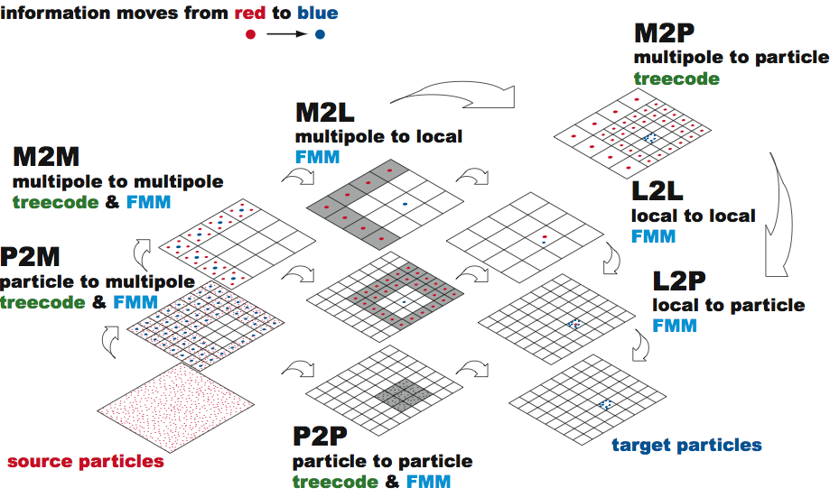

# Fast Multipole

  L. Greengard, V. Rokhlin: <em>A fast algorithm for particle simulations.</em> J. Comp. Phys., 73, 1987.
  
  C. R. Anderson: <em>An implementation of the Fast Multipole Method without multipoles.</em>.
  SIAM J. Sci. Stat. Comput. 13(4), 1992.

---

# Complexity of Fast Multipole

Lets do a computation with $N = 10^6$ particles assuming that $N$ computations take 1 hour

- $O(N)$ algorithm $\to$ 1 hour
- $O(N\log N)$ algorithm $\to$ $14$ hours
- $O(N^2)$ algorithm $\to$ $10^{6}$ hours, or 114 years

---

# Fast Multipole Method:
- define a pseudo particle (as in Barnes-Hut) for each cell
 $\to$ accumulated mass located in centre of mass
- force computation:
   1. between particles in the same or in adjacent cells: add particle--particle force 
   2. between particles in separated cells: 
      * add forces between corresponding pseudo-particles;
      * accumulate that force to all particles of a pseudo particle

---

# Fast Multipole Method

<small>Image from the Master thesis of Fabio Gratl </small>

---

# Required kernels

### P2M: Particle to Multipole

- in Barnes-Hut this involved summing the mass, and computing the center of mass
    
  $\to$ locate centre of mass $X_l := \frac{1}{M_l} \sum_j m^{(l)}_j x^{(l)}_j$

  $\to$ accumulated mass $M_l := \sum_j m^{(l)}_j $

- in FMM: use multipole expansion

---

# Constructing Multipoles (M2M/P2M)

## 2 Approaches: 

### Original Approach of Greengard/Rohlkin, 1987
- similar concept as Taylor series
- complicated to derive, esp. in 3D (spherical harmonics) 
- complicated formula for hierarchical assembly

---

# Constructing Multipoles (M2M/P2M)

## 2 Approaches: 

### Or: inner/outer ring approximations by Anderson, 1992
- derived via numerical integration of an integral formula
- uniform interaction with child and remote boxes
- hierarchical assembly via evaluation of potentials at integration points

---

# Anderson's method

<b>Fundamental idea:</b> represent potential via a surface integral

$$ \Psi_a (\vec{x}) = \int\limits_{S^2} g( a \vec{s} )
   \left(  \sum\limits_{n=0}^\infty \left( \frac{a}{r} \right)^{n+1} Q_n(\vec{s} \cdot \vec{x}_p )
   \right) 
   ds $$

- in spherical coordinates $\vec{x} = ( r, \theta, \psi)$,
- with suitable $Q_n$ (charges or mass)
- $\vec{x}_p = ( 1, \theta, \psi)$,
- $g( a \vec{s} )$ the potential on a sphere of radius $a$ that contains all particles 

---

# Anderson's method
- and use numerical integration to compute the integral

$$ \Psi_a (\vec{x}) \approx \sum\limits_{i=1}^K w_i \, g( a \vec{s}_i )
            \left(  
              \sum_n ( \frac{a}{r} )^{n+1} 
              Q_n(\vec{s}_i \cdot \vec{x}_p )
            \right)$$

- using $K$ integration points $\vec{s}_i$ on the sphere $S^2$ (weights $w_i$)
- and choosing $M$ relative to accuracy of integration rule

---

# Anderson's method

$$ \Psi_a (\vec{x}) \approx \sum w_i \, g( a \vec{s}_i )
     \left(  \sum\limits_n \left( \frac{a}{r} \right)^{n+1} Q_n(\vec{s}_i \cdot \vec{x}_p )
  \right) $$

</img>

only $g( a \vec{s}_i )$ need to be computed and stored for each box

- ---

# Required kernels

## P2M: Particle to multipole

- Original approach: compute multipole expansion, i.e. "Taylor-series"
- With Anderson's method: compute surface integral with numerical integration
  - approximate potential caused by all particles of the current box 
  - evaluate and accumulate particle potentials at positions $a \vec{s}_i $ to obtain values $g( a \vec{s}_i )$

---

# Required kernels

# M2M: Multipole to Multipole

</img>

  - approximate potential caused by all child boxes of the current box 
  - evaluate and accumulate outer ring approximations of all child boxes at positions $a \vec{s}_i $
     (of the parent box) to obtain values $g( a \vec{s}_i )$

---

<section>
  <h3>Upward Pass</h3>

### Subdivide domain into quadtree/octree

<small>

- start in root node
- descent into subdomains and subdivide for $L$ levels (can have multiple particles per cell at lowest level)

<input type="range" name="addLevel" id="addLevel" min="0" max="5" step="1" value="0">Add levels 

- Next:
  1. P2M: particle to multipole
  2. M2M: multipole to multipole

</small>

  

  

</section>

---

# Required kernels

### M2L: Multipole to Local

- box--box interactions occur at multiple levels 
   
  $\to$ as particles are part of all parent/grand-parent pseudo particles, the interaction between two particles might be captured by box--box interactions on multiple levels

  $\Rightarrow$ make sure that each particle--particle interaction is considered exactly once!

---

# Required kernels

### M2L: Multipole to Local

- force computation between pseudo particles occurs, if:
   1. pseudo particles are not in cells that are direct neighbours (requires particle--particle interaction, no approximation via pseudo particles allowed) 
   2. interaction between the boxes that contain those pseudo particles is not considered on coarser levels
        
     $\to$ considers comparably few interactions on each level that are ``nearby'' but neither direct neighbours nor too far away

---

# "Horizontal" Pass

</img>

---

# "Horizontal" Pass

### Compute forces -- far-field (M2L)

- For a cell $C_l$:
  - compute interactions with cells that are not direct neighbors and have not been considered on previous levels

### Compute forces -- near-field (P2P)

- For a cell $C_L$ on the finest level $L$:
  - compute particle to particle forces for neighboring cells and within the cell

---

# Required kernels: Downward Pass

- For a leaf cell:
  - compute local to particle interaction (L2P)

- For any other cells:
  - compute a local to local interaction (L2L)

---

# Required kernels: Downward Pass

</img>

---

# Fast Multipole Method -- Summary

R. Yokota: 
<url>https://www.bu.edu/pasi/courses/12-steps-to-having-a-fast-multipole-method-on-gpus/</url>

</img>

---

# Fast Multipole Method -- Summary

1. <b>Initialization:</b> Choose a number of levels such that there are approx. $s$ particles per cell at the finest level. $\to$ $N/s$ cells
  
2. <b>Upward Pass:</b>  Beginning at the finest level create multipole expansions (P2M). Expansions  cells at higher levels formed by the merging (M2M).

2. <b>Downward Pass:</b>  Compute the far-field (M2L)  and near-field (P2P). Convert the multipole expansion into a local expansion about the centers of all cells (L2L/L2P).

---

# Fast Multipole Method -- Summary

## Accuracy:
- depends on accuracy of integration rule 
    
  $\to$ determined by number of integration points

- in practice: can be increased to allow approximations that are accurate up to machine precision

---

# Fast Multipole Method -- Summary

## Complexity:
- computation of box-approximations, i.e., all $g( a \vec{s}_i )$ 
  
  $\to$ constant effort per box (leaf and inner boxes)
  
  $\to$ thus $O(N_\text{B})$ effort ($N_\text{B}$ boxes); 
    
- if max. number of particles per box is constant then $O(N)$ for $N$ particles
- computation of forces
  
  $\to$ multilevel algorithms leads to $O(N)$ effort

---

# Comparison of Barnes-Hut and FMM

Approximate potential of sets/clusters of particles

1. <b>Barnes-Hut</b>
  - pseudo particles in tree cells
  - $\theta$-criterion to determine far-field 

2. <b>Fast Multipole</b>
  - higher-order representations necessary! 
  - no $\theta$-criterion to tune accuracy (instead choose number of terms in expansion)

---

# Comparison of Barnes-Hut and FMM

Hierarchical computation of box potentials

1. <b>Barnes-Hut</b>
  - combine pseudo particles in child cells

2. <b>Fast Multipole</b>
  - generate high order box potentials
  - (accumulate approximate potentials of child boxes to approximate potential of parent box $\to$ needs to be derived for high-order representation)

