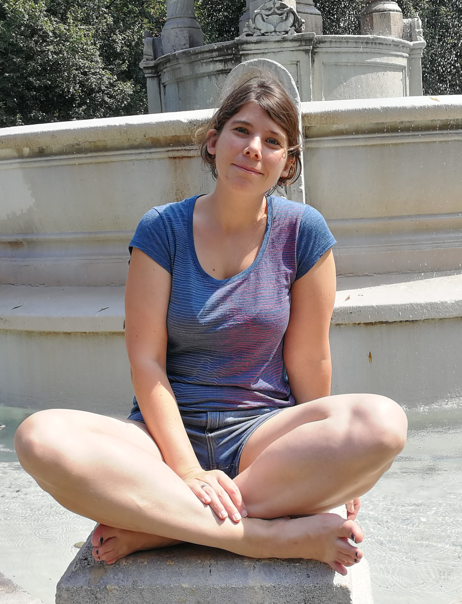

I am currently an assistant professor at Durham University in the [Scientific Computing Group](https://community.dur.ac.uk/scicomp/).
We run a [seminar series](https://community.dur.ac.uk/scicomp/events/), if you are interested in speaking, please let me know.

I research at the interface of three main areas: Application science (mechanical engineering, astrophysics and seismology), numerical methods development (fast solvers, high performance computing)
and uncertainty quantification.

