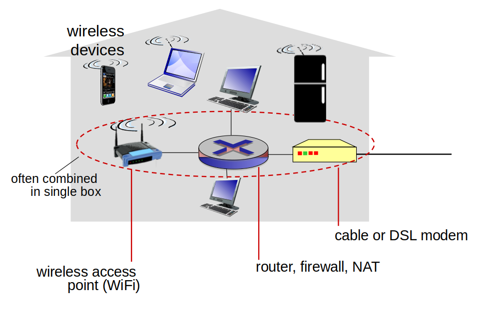
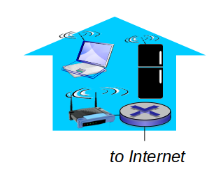

# Outline

- Introductory remarks
- Network overview and its components
- Network protocol
- Physical media
- Network security

---

# Introductory Remarks

### Lecturer:
- <a href="https://annereinarz.github.io">Anne Reinarz</a>
- <a href="mailto:anne.k.reinarz@durham.ac.uk">anne.k.reinarz@durham.ac.uk</a>

---

# Introductory Remarks

### Practicals:
- Demonstrators will be present to assist you in the labs
- Currently planned to take place in person
- Labs described on DUO (weeks 2,4,6,8, and 10)

---

# Introductory Remarks

### Assessment:
- 100% coursework
- Hand out date: Week 4 (Monday 26th October)
- Hand in date: Term 2 (Monday 11th February)

---

# Introductory Remarks

- All lectures will take place via zoom
- Please remain muted unless you want to ask a question
- Questions can also be typed in the chat
- Office hours can be arranged by email

---

# Course Outline
- Network standards and basic network architecture
- Client-server and P2P (Peer to Peer) networks
- Sockets and socket programming: TCP and UDP
- Routing algorithms
- Error detection and recovery
- Digital modulation approaches

---

# Emphasis on:
- How networks function
- How to write network applications

---

# Reading Material

</img>

<a href="https://discover.durham.ac.uk/primo-explore/fulldisplay?docid=44DUR_LMS_DS.b26223934&context=L&vid=44DUR_VU4&lang=en_US&search_scope=LSCOP_LIB-ARC&adaptor=Local%20Search%20Engine&isFrbr=true&tab=default_tab&query=any,contains,tanenbaum%20networks&sortby=date&facet=frbrgroupid,include,142418333&offset=0">Link</a>

</img>

<a href="https://discover.durham.ac.uk/primo-explore/fulldisplay?docid=44DUR_LMS_DS.b29529281&context=L&vid=44DUR_VU4&lang=en_US&search_scope=LSCOP_LIB-ARC&adaptor=Local%20Search%20Engine&isFrbr=true&tab=default_tab&query=any,contains,pearson%20networking&sortby=date&facet=frbrgroupid,include,143175967&offset=0">Link</a>

---

# Computer Network

---

# Computer Network

### Definition:

A computer network is a group of devices that are connected to one another in order to exchange information or share resources.

&nbsp;

What are the main components and devices?

---

## The Internet: "nuts and bolts" view

- Billions of connected computing devices: 
</img>
    - Hosts = end systems
    - Running network apps

---

## The Internet: "nuts and bolts" view

</img>

- Communication links
    - Fiber, copper, radio, satellite
    - Transmission rate: bandwidth

- Packet switches: forward packets (chunks of data)
    - Routers and switches

---

## The Internet: "nuts and bolts" view

- Internet: “network of networks”
    - Interconnected ISPs
- Protocols control sending, receiving of messages
    - e.g., TCP, IP, HTTP, Skype,  802.11
- Internet standards
    - RFC: Request For Comments
    - IETF: Internet Engineering Task Force

---

# What’s a protocol?

---

# What’s a protocol?

Protocols define the format and order of messages sent and received among network entities, and actions taken on message transmission and receipt.

 

- specific messages sent
- specific actions taken when messages received, or upon other events

---

# What’s a protocol?

### Human protocols:
- “what’s the time?”
- “I have a question”
- Introductions...

### Network protocols:

- Machines rather than humans
- All communication activity in Internet governed by protocols

---

# Protocol Examples

- a human protocol and a computer network protocol:

</src>

---

# Access network: 

---

# Access network: 
## digital subscriber line (DSL)

</img>

---

# Access network: 
## digital subscriber line (DSL)

- Use existing telephone line to central office DSLAM
    - data over DSL phone line goes to Internet
    - voice over DSL phone line goes to telephone net
 
- Asymmetric access: downstream and upstream rates are different
    - < 2.5 Mbps upstream transmission rate (typically < 1 Mbps)
    - < 24 Mbps downstream transmission rate (typically < 10 Mbps)

---

# Access network: 
## cable network

</img>

---

# Access network: 
## cable network

- HFC: hybrid fiber coax
    - asymmetric: up to 42.8 Mbps downstream transmission rate, 30.7 Mbps upstream transmission rate
- Network of cable, fiber attaches homes to ISP router
    - homes share access network to cable headend 
    - unlike DSL, which has dedicated access to central office

---

# Enterprise access networks:
## Ethernet

</img>

---

# Enterprise access networks:
## Ethernet

- Widely used in companies, universities, etc.
- 10 Mbps, 100Mbps, 1Gbps, 10Gbps transmission rates
- Today, end systems typically connected by Ethernet switches

---

# Access network: 
## home network

</img>

---

# Wireless access networks

- Shared wireless access network connects end system to router
    - via base station, aka “access point”

---

# Wireless access networks

</img>

- Wireless LANs:
    - Within building (~100 ft.)  
    - 802.11 (WiFi)
    - 54~1300 Mbps transmission rate

</img>
- Wide-area wireless access
- Provided by telco (mobile) operator, 10’s of km
- Between 1 and 10 Mbps 
- 3G, 4G,  LTE (“Long Term Evolution”), 5G

---

# Internet of Things (IoT)

</img>

<a href="https://arstechnica.com/cars/2020/02/driver-stranded-after-connected-rental-car-cant-call-home/">Link</a>

---

# Physical Media

---

# Physical Media

- Bit
    - propagates between transmitter/receiver pairs
- Physical link
    - what lies between transmitter & receiver
- Guided media
    - signals propagate in solid media: copper, fiber, coax
- Unguided media
    - signals propagate freely, e.g. radio

---

# Physical Media

### Types of physical media:
- Twisted pair (TP)
- Copper wire
- Coaxial cable
- Fibre optic
- Terrestrial radio spectrum
- Satellite radio spectrum

---

# Physical Media

</src>

## Twisted pair:
- Two insulated copper wires
- Category 5: 10 Mbps, 1 Gbps Ethernet
- Category 6: 10 Gbps

<a title="Tkgd2007 / CC BY (https://creativecommons.org/licenses/by/3.0)" href="https://commons.wikimedia.org/wiki/File:Coaxial_cable_cutaway.svg"></img></a>

## Coaxial cable:
- Two concentric copper conductors
- Can achieve high data transmission rates

---

# Physical Media

</src>

### Fiber optic cable:

- Glass fibre carrying light pulses representing bits
- High-speed operation:
    - High-speed point-to-point transmission (e.g., 10’s-100’s Gbps transmission rate)
- Low error rate: 
    - Repeaters spaced far apart 
    - Immune to electromagnetic noise

---

# Physical Media

### Radio

- Signal carried in electromagnetic spectrum
- No physical “wire”
- Carry a signal for long distances
- Propagation environment effects:
    - Reflection 
    - Obstruction by objects
    - Interference

Classified into 3 groups:
- Very short distance (e.g. Bluetooth)
    - 5~10 metres
- LAN (e.g., WiFi)
    - 10 to a few hundred meters
-  Wide-area (e.g., cellular/mobile)
    - Tens of miles

---

# Physical Media

### Satellite Radio Channels

<a title="ISS Twitter" href="https://twitter.com/Space_Station"></img></a>

- Two types of satellites for communications:
    - geostationary (~36000 km above earth, stationary)
    - used where DSL or cable-based access is unavailable
    - low-earth orbiting (closer to earth, move over the surface)

---

# Network security

### Network security
- How bad actors can attack computer networks
- How to defend networks against attacks
- How to design architectures resistant to attacks

---

# Network security

### Internet originally designed with little security
- Original vision: “a group of mutually trusting users attached to a transparent network” 
- Internet protocol designers playing “catch-up”
- Security considerations in all layers!

---

# Network security

# Packet sniffing: 
- Broadcast media (shared Ethernet, wireless)
- “Promiscuous” network interface reads/records all packets (e.g., including passwords!) passing by
</src>
- Wireshark software used in the labs is an open source packet-sniffer

---

# Summary

- An overview of Networks and network components
- An overview of protocols
- Different types of physical media for data transmission in networks
- Network security

## Reference:
1. Computer Networking: A Top-Down Approach [Chapter 1]
