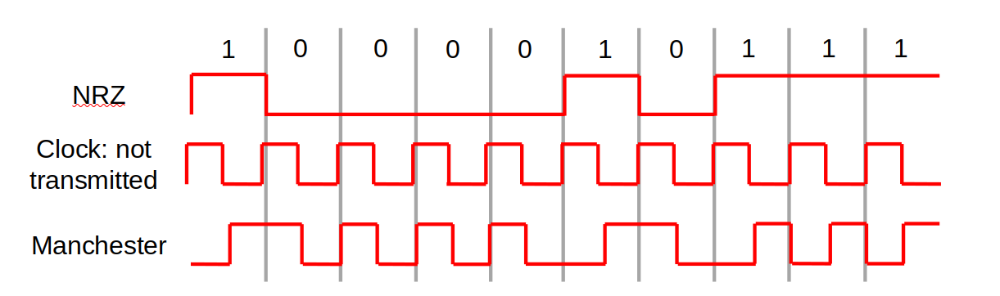

# MAC Layer

---

# Outline

- Elements of wireless network 
- Wireless links, characteristics, and types
- IEEE 802.11 wireless LANs (“Wi-Fi”) and features
    - Signals
    - Hidden and exposed terminal
    - Wireless LAN standards & architecture
- Channeling, association and scanning
- IEEE 802.11 MAC protocol
    - CSMA/CA
    - IEEE 802.11 framing

---

# 802.11 LAN architecture

</img>

- Wireless host communicates with base station
- Base station = access point (AP)
- Basic Service Set (BSS) (aka “cell”) in infrastructure mode contains:
    - Wireless hosts
    - Access point (AP): base station
    - Ad hoc mode: hosts only

---

# 802.11: Channels, association
- 802.11b: 2.4GHz-2.485GHz spectrum divided into 11 channels at different frequencies
    - AP admin chooses frequency for AP
    - Interference possible: channel can be same as that chosen by neighboring AP!

---

# 802.11: Channels, association

- Host must associate with an AP
    - Scan channels, listening for beacon frames containing AP’s name (SSID) and MAC address
    - Selects AP to associate with
    - May perform authentication 

---

# 802.11: passive/active scanning

</img>

---

# IEEE 802.11: multiple access
- Avoid collisions: 2+ nodes transmitting at same time
- 802.11: CSMA - sense before transmitting
    - Don’t collide with ongoing transmission by other node

---

# IEEE 802.11: multiple access
- 802.11: no collision detection!
    - Difficult to receive (sense collisions) when transmitting due to weak received signals (fading)
    - Can’t sense all collisions in any case: hidden terminal, fading
    - Goal: avoid collisions: CSMA/C(ollision)A(voidance)

---

# IEEE 802.11 MAC Protocol: CSMA/CA
### 802.11 sender
1. If sense channel idle for DIFS (Distributed Inter-Frame Space) 
    - then transmit entire frame (no CD)
2. If sense channel busy then 
    - start random backoff time
    - timer counts down while channel idle
    - transmit when timer expires
    - if no ACK, increase random backoff interval, repeat step 2.

---

# IEEE 802.11 MAC Protocol: CSMA/CA

### 802.11 receiver
- If frame received OK
   - return ACK after SIFS (Short Inter-Frame Space)
   - ACK needed due to hidden terminal problem)

---

# IEEE 802.11 MAC Protocol: CSMA/CA
</img>

---

# Avoiding collisions

Idea:  allow sender to “reserve” channel rather than random access of data frames: avoid  collisions of long  data frames

---

# Avoiding collisions

- Sender first transmits small request-to-send (RTS) packets to BS using CSMA
    - RTSs may still collide with each other (but they’re short)
- BS broadcasts clear-to-send CTS in response to RTS
- CTS heard by all nodes
    - Sender transmits data frame
    - Other stations defer transmissions 

---

# Collision Avoidance: RTS-CTS exchange

</img>

---

# 802.11 frame: addressing

</img>

---

# Physical Layer

---

# Outline

- Bandwidth of signals and channels
- Digital modulation schemes (NRZ, NRZI,  Manchester etc.)
- Multiplexing

---

# Bandwidth

### Two distinct senses:
1. Synonymous with “bit rate” (rate of data transmission)
    - E.g. 10Mbps
2. Width of a range of frequencies (e.g. as used by a signal)
    - E.g. 0 Hz through 10 MHz		(10 MHz bandwidth)
    - E.g. 20 MHz through 30 MHz	(10 MHz bandwidth)

---

# Bandwidth

- Baseband: a range running from 0 to some maximum frequency. Typically applicable to wired media. 
- Passband: signals occupying some range of frequencies, as would pass through corresponding frequency filters. 
    - E.g. 802.11b channel #3: 2.411GHz ~ 2.433GHz
    - Channel has bandwidth of: 2.433-2.411 GHz = 22 MHz
- “Available” bandwidth
    - Range of frequencies usefully transmissible in a medium
    - A physical property of the transmission medium

---

# Digital Signals
- 0s and 1s may take on many possible representations when transmitted
    - Some representations have desirable properties for particular media

Digital signals are obtained from an analog signal: 
Information transmitted by varying some physical property such as voltage or current

---

# Digital Modulation

- Digital signals (0, 1) are encoded by (e.g.) low and high voltage
- Digital Encoding Schemes:
    - Non-Return-to-Zero (NRZ)
    - Non-Return-to-Zero-Inverted (NRZ-I)
    - Bipolar encoding, a.k.a. Alternate Mark Inversion (AMI)
    - Manchester encoding

---

# 1. NRZ Encoding

- A high voltage represents a 1
- A low voltage represents a 0

- The name NRZ refers to the fact the voltage does Not Return to Zero, it changes only when the bit value changes

---

# 1. NRZ Encoding

</img>

---

# 1. NRZ Encoding

- Relies on sender and received having accurate, in sync “clocks”
- Transitions (from +v to -v, or -v to +v) can be used to correct small deviations
- Problem: long runs of consecutive bits with same value [no changes in voltage] the constant signal values cannot synchronize the communicating devices 
- Various other schemes offer possible solutions to this problem (recall: bitstuffig)

---

# 2. NRZI (inverted) Encoding

- NRZI attempts to alleviate the problem in NRZ
    - '0' is encoded as no change in the level
    - '1' is encoded depending on the current state of the line.
- If the current state is low voltage the '1' will be encoded as a high voltage, if the current state is again high voltage the '1' will be encoded as a low voltage

---

# 2. NRZI (inverted) Encoding

</img>

- This fixes the problem of sending consecutive 1s  but not consecutive 0s

---

# 3. Bipolar Encoding

- 0 is represented by a zero voltage, neither high nor low.
- 1 is represented by either positive voltage or negative voltage.
    - Chosen voltage inverted from the last transmission of 1
    - I.e. represented by a negative voltage if it was represented by a positive voltage when it was last transmitted, and vice versa

---

# 3. Bipolar Encoding

</img>

- “Balanced encoding”
    - sum voltage 0
    - desirable in some applications

---

# 4. Manchester Encoding

- Merge an explicit clock signal with the data signal
    - Use XOR to merge the two
- Low-to-high voltage transition represents 1
- High-to-low voltage transition represents 0
    - Inverse of this convention is sometimes used

---

# 4. Manchester Encoding

</img>

---

# 4. Manchester Encoding

- Uses signal changes to transmit data and achieve synchronization

- Guaranteed transitions – occur with each bit transmitted

- Problem: Twice the bandwidth of NRZ is required

---

# Multiplexing

---

# Multiplexing

- Channels are often shared by multiple signals
- Different ways to accomplish multiplexing:
    - FDM (Frequency Division Multiplexing)
    - WDM (Wavelength Division Multiplexing)
    - TDM (Time Division Multiplexing)
    - CDMA (Code Division Multiple Access)

---

# Frequency Division Multiplexing

</img>

---

# Wavelength Division Multiplexing

</img>

---

# Time Division Multiplexing

</img>

---

# CDMA – Code Division Multiple Access

- Method allowing every transmitter to use the entire channel all the time
- Individual transmissions are extracted by a receiver using coding theory
- Channel itself merges the transmissions

---

# CDMA – Code Division Multiple Access

- Suppose we have four transmitters called, from now on, stations
- Each station has a “chip” (i.e. code), which is a four-bit vector, e.g.:
    - A : (+1 +1 +1 +1)
    - B : (+1 −1 +1 −1)
    - C : (+1 +1 −1 −1)
    - D : (+1 −1 −1 +1)
- These “chips” are chosen so that they are all orthogonal to one another:
    - A · B = 0,    B · A = 0, …   A · C = 0, …

---

# CDMA – Code Division Multiple Access

- For mathematical simplicity, we will call the two binary states -1 and +1
- Stations transmit data by transmitting either:
- Their chip sequence, to transmit a 1
- The negation of their chip sequence, to transmit a -1
- Nothing at all if they do not wish to transmit

---

# CDMA – Code Division Multiple Access

- A : (+1 +1 +1 +1)
- B : (+1 −1 +1 −1)
- C : (+1 +1 −1 −1)
- D : (+1 −1 −1 +1)

- For instance, in this example:
    - B can transmit a +1 data value by transmitting:  +1,  -1, +1,  -1
    - B can transmit a -1 data value by transmitting:	-1, +1,  -1, +1

---

# Summary

- Bandwidth of signals and channels
- Digital modulation schemes (NRZ, NRZI, Manchester, etc.)
- Multiplexing (FDM, TDM, WDM, and CDMA)

