# Re-cap
- Network overview and its components
- Network protocols
- Different types of networks
- Physical media
- Network security

---

# Outline
- Network core
    - Packet switching
    - Circuit switching
- Delay and loss in networks
- Protocol layers

---

# The network core

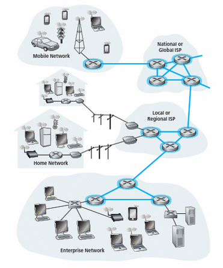</img>

- Mesh of interconnected routers
- Packet-switching: hosts break application-layer messages into packets
    - Forward packets from one router to the next, across links on path from source to destination
    - Each packet transmitted at full link capacity

---

## Packet-switching: store-and-forward

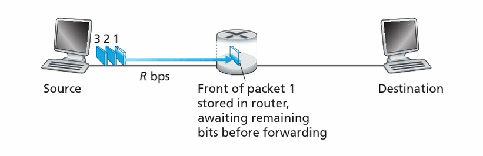</img>
- Takes L/R seconds to transmit (push out) L-bit packet into link at R bps
- Store and forward: entire packet must  arrive at router before it can be transmitted on next link
    - End-end delay = 2L/R (assuming zero propagation delay)

---

## Packet Switching:  queuing delay and  loss

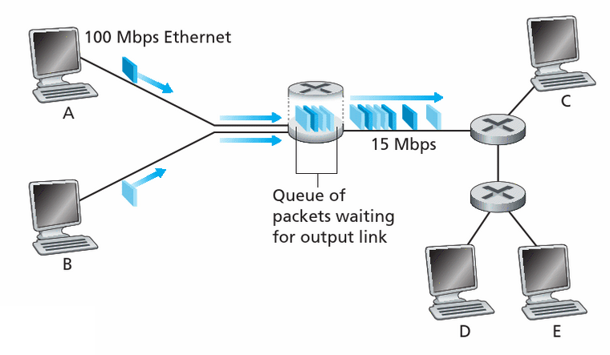</img>

- If arrival rate (in bits) to link exceeds transmission rate of link for a period of time:
    - Packets will queue, wait to be transmitted on link. 
    - Packets can be dropped (lost) if memory (buffer) fills up

---

# Two key network-core functions

1. Routing: determines source-destination route taken by packets

2. Forwarding: move packets from router’s input to appropriate router output

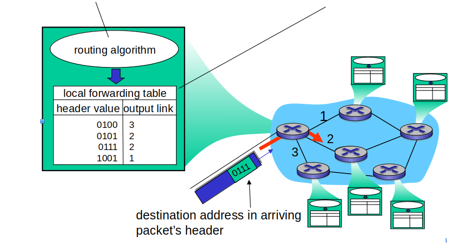</img>

---

# How do loss and delay occur?

- Packets queue in router buffers 
    - Packet arrival rate to link (temporarily) exceeds output link capacity
    - Packets queue, wait for turn

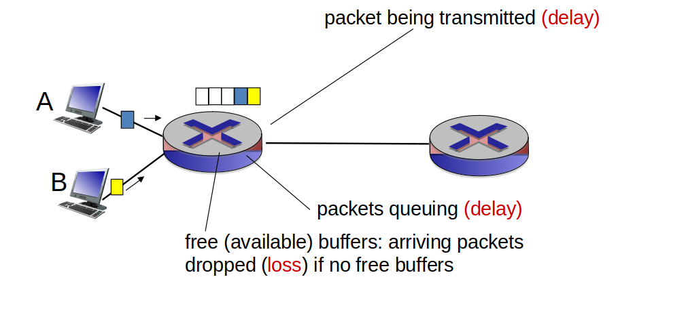</img>

---

# Four sources of packet delay

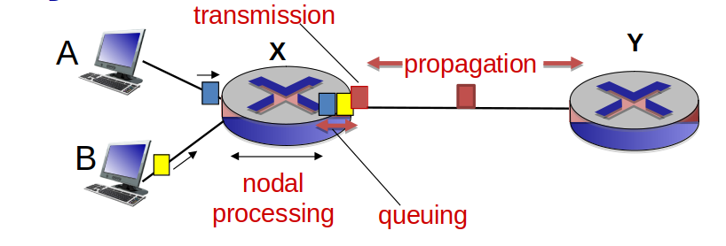</img>

## $d_{nodal} = d_{proc} + d_{queue} + d_{trans} + d_{prop}$

---

# Four sources of packet delay

- $d_{proc}$: nodal processing:
    - Check bit errors
    - Determine output link
    - Typically < msec
- $d_{queue}$: queueing delay:
    - Time waiting at output link for transmission 
    - Depends on congestion level of router

- $d_{trans}$: transmission delay:
    - L: packet length (bits) 
    - R: link bandwidth (bps)
    - $d_{trans}$ = L/R
- $d_{prop}$: propagation delay:
    - d: length of physical link
    - s: propagation speed (~2x108 meters/sec)
    - $d_{prop}$ = d/s

---

# A practical example

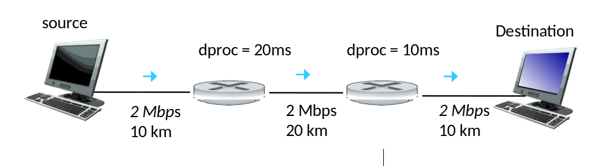</img>

- How long does it take a packet of 1Mb from source to destination?
- Assume that the propagation speed in all segments is 2 km/s

---

# Packet loss

- Queue (aka buffer) preceding link in buffer has finite capacity
- Packet arriving to a full queue dropped (aka lost)
- Lost packet may be retransmitted by previous node, by source end system, or not at all

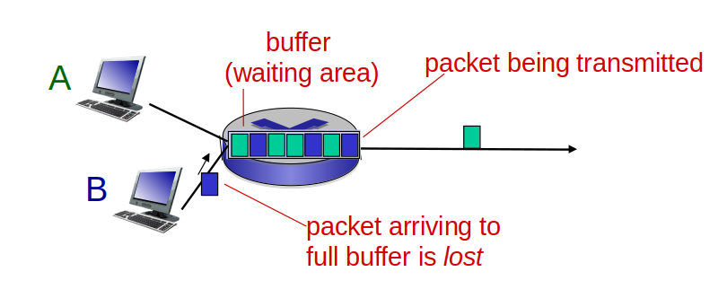</img>

---

# “Real” Internet delays and routes
- What do “real” Internet delay & loss look like? 
- traceroute program: provides delay measurement from source to router along end-end Internet path towards destination.  
- For all i:
    - Sends three packets to router i on path towards destination
    - Router i will return packets to sender
    - Sender times interval between transmission and reply

---

# “Real” Internet delays and routes

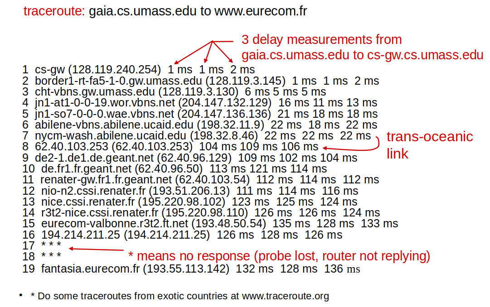</img>

---

# Alternative core: circuit switching

### End-end resources allocated to, reserved for “call” between source and destination:
- In diagram, each link has four circuits. 
    - Call gets 2nd circuit in top link and 1st circuit in right link.
- Dedicated resources: no sharing
- Circuit-like (guaranteed) performance
- Circuit segment idle if not used by call (no sharing)
- Commonly used in traditional telephone networks

---

# Alternative core: circuit switching

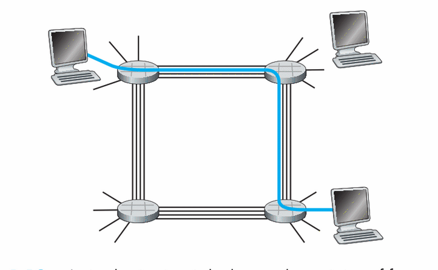</img>

---

# Protocol layers

---

# Protocol layers

- Protocols determine the format and order of messages between devices
- Protocol layering has conceptual and structural advantages

### Protocol stack: protocols of the various layers

---

# Protocol layers

- Layers: each layer implements a service
    - Via its own internal-layer actions
    - Relying on services provided by layer below

  

## Why layering?

---

# Protocol layers

- Explicit structure allows identification, relationship of complex system’s pieces
    - Layered reference model for discussion
- Modularization eases maintenance, updating of system
    - Change of implementation of layer’s service transparent to rest of system 

  

### Layering considered harmful?

---

# Internet protocol stack

### <b>Application:</b> supporting network applications
- FTP, SMTP, HTTP

### <b>Transport:</b> process-process data transfer
- TCP, UDP

### <b>Network:</b> routing of datagrams
- IP, routing protocols

### <b>Link:</b> data transfer between neighboring network elements
- Ethernet, 802.11 (WiFi), PPP

### Physical: bits “on the wire”

---

# ISO/OSI reference model

- <b>Presentation:</b> allow applications to interpret meaning of data, e.g., encryption, compression, machine-specific conventions
- <b>Session:</b> synchronization, checkpointing, recovery of data exchange
- Internet stack “missing” these layers!
    - These services, if needed, must be implemented in application

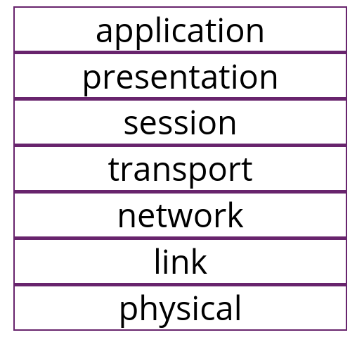</img>

---

# Summary

- Network core,
    - Packet-switching
    - Circuit-switching
    - Packet loss
    - Internet delay 
- Layering, service models

