# Re-cap

- Network core
    - Packet switching
    - Circuit switching
- Delay and loss in networks
- Protocol layers

---

# Packet-switching: store-and-forward

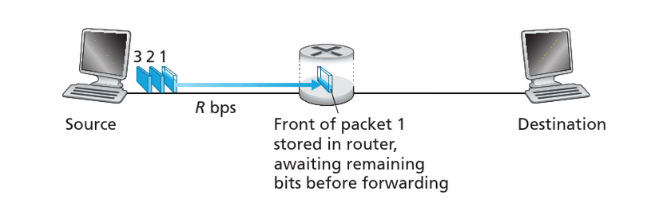</img>

- Store and forward: entire packet must  arrive at router before it can be transmitted on next link
- Takes L/R seconds to transmit (push out) L-bit packet into link at R bps

---

## Packet Switching:  queuing delay and  loss

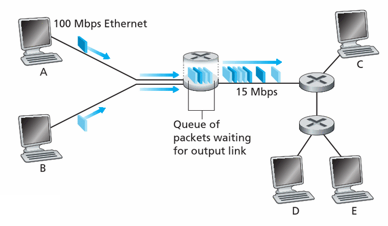</img>

- If arrival rate (in bits) to link exceeds transmission rate of link for a period of time:
    - Packets will queue, wait to be transmitted on link. 
    - Packets can be dropped (lost) if memory (buffer) fills up

---

# Two key network-core functions

1. Routing: determines source-destination route taken by packets

2. Forwarding: move packets from router’s input to appropriate router output

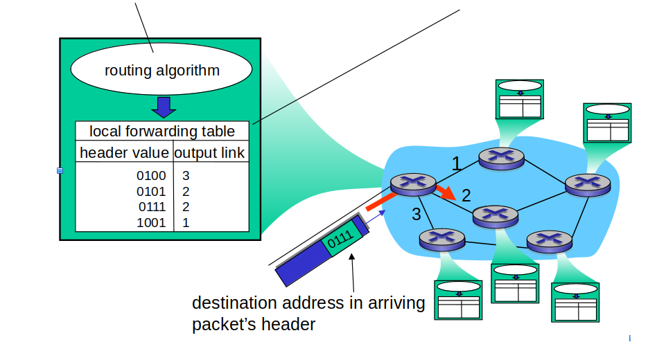</img>

---

# Alternative core: circuit switching

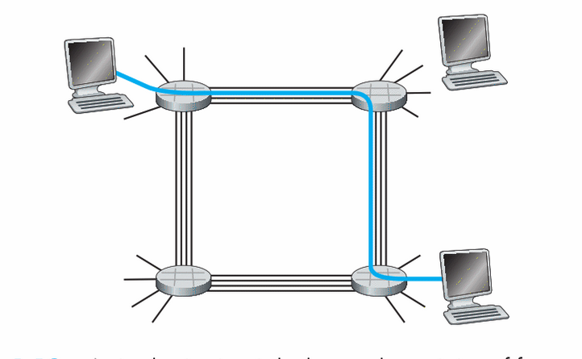</img>

---

# Internet protocol stack

### <b>Application:</b> supporting network applications
- FTP, SMTP, HTTP

### <b>Transport:</b> process-process data transfer
- TCP, UDP

### <b>Network:</b> routing of datagrams
- IP, routing protocols

### <b>Link:</b> data transfer between neighboring network elements
- Ethernet, 802.11 (WiFi), PPP

### Physical: bits “on the wire”

---

# Outline 

- Network architecture: 
    - Client-server architecture 
    - P2P architecture

- Protocols: 
    - TCP (Transmission Control Protocol)
    - UDP (User Datagram Protocol)

- Socket programming: 
    - TCP
    - UDP

---

# Creating a network app

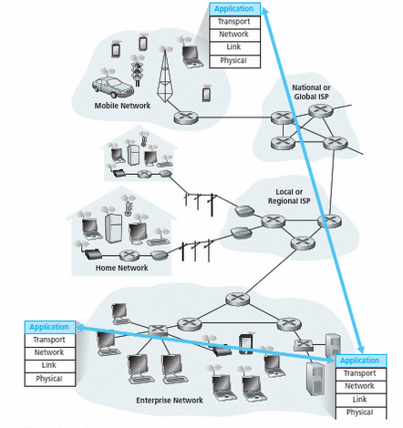</img>

---

# Creating a network app

### Write programs that:
- Run on (different) end systems
- Communicate over network
    - E.g., web server software communicates with browser software

---

# Creating a network app

### No need to write software for network-core devices
- Network-core devices do not run user applications 
- Applications on end systems allow for rapid app development, propagation

---

# Application architectures

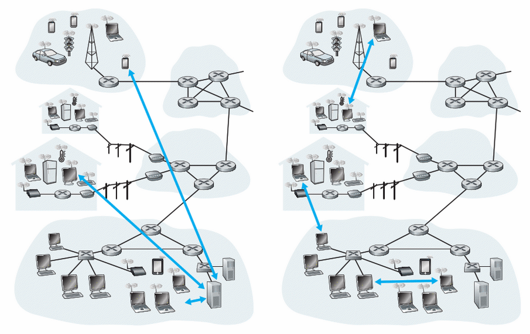</img>

### Possible structures of applications:
- Client-server
- Peer-to-peer (P2P)

---

# Client-server architecture

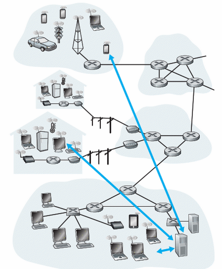</img>

### Server: 
- Always-on host
- Fixed (static) IP address
- Data centres for scaling

---

# Client-server architecture

</img>

### Clients:
- Communicate with server
- May be intermittently connected
- May have dynamic IP addresses
- Do not communicate directly with each other

---

# P2P architecture

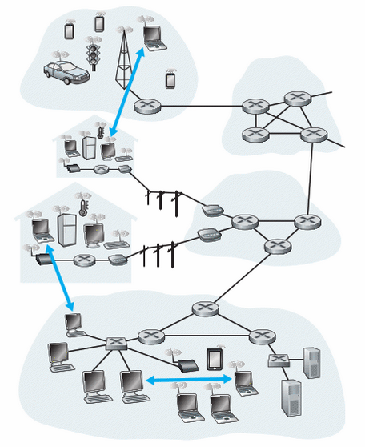</img>

- No always-on server
- Arbitrary end systems directly communicate
- Peers request service from other peers, provide service in return to other peers
    - Self scalability: new peers bring new service capacity, as well as new service demands
- Peers are intermittently connected and change IP addresses

---

# Processes communicating

<b>Process:</b> program running within a host

- Within same host, two processes communicate using  inter-process communication (defined by OS)
- Processes in different hosts communicate by exchanging messages

---

# Processes communicating

<b>Socket:</b> a software mechanism that allows a process to create and send messages into, and receive messages from the network.

- A process is analogous to a house, and its socket is analogous to its door
- Interface between application layer and  transport layer.

---

# Sockets

- Process sends/receives messages to/from its socket
- Socket analogous to door
- Sending process shoves message out of the door
- Sending process relies on transport infrastructure on other side of the door to deliver message to a socket at the receiving process

---

# Sockets

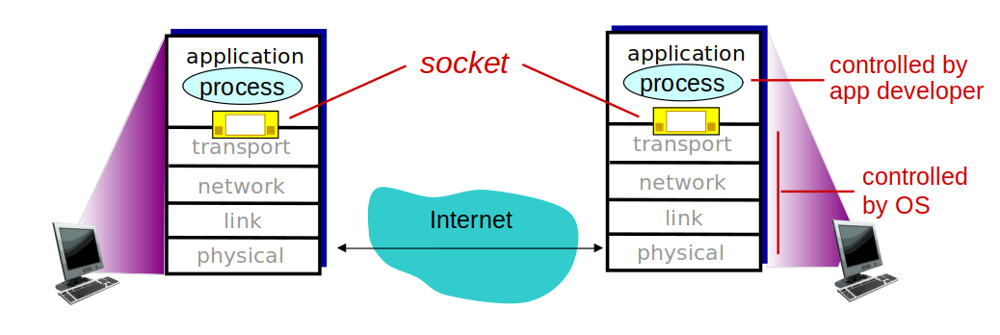</img>

---

# What transport service does an app need?

### Data integrity
- Some apps (e.g., file transfer, web transactions) require 100% reliable data transfer 
- Other apps (e.g., audio) can tolerate some loss

---

# What transport service does an app need?
### Security
- Encryption, data integrity, ...

---

# What transport service does an app need?
### Timing
- Some apps (e.g., Internet telephony, interactive games) require low delay to be “effective

---

# Internet transport protocols services

### TCP service:
- Connection-oriented: setup required between client and server processes
- Reliable transport between sending and receiving process
- Flow control: sender won’t overwhelm receiver 
- Full-duplex connection: connection can send messages to each other at the same time

---

# Internet transport protocols services

### UDP service:
- Unreliable data transfer between sending and receiving processes
- Does not provide: reliability, flow control, congestion control, timing, security, or connection setup

---

# P2P architecture: example

- P2P messenger
- using TCP

---

# P2P architecture: solution

<pre><code>import socket
import threading
import sys
from getopt import getopt

def receiver(address):
    with socket.socket() as s:
        s.bind(address)
        s.listen(1)
        while True:
            connection, (peer_ip, _) = s.accept()
            with connection:
                message = connection.recv(1024).decode()
                print("{}: {}".format(peer_ip, message))

def sender(address):
    while True:
        message = input(">> ")
        with socket.socket() as s:
            s.connect(address)
            s.sendall(message.encode())

def start():
    o = dict(getopt(sys.argv[1:], 'h:p:l:')[0])
    threading.Thread(target=receiver, args=(('', int(o.get('-l',8080))),)).start()
    threading.Thread(target=sender, args=((o.get('-h',''), int(o.get('-p',8080))),)).start()

if __name__ == "__main__":
    start()
</code></pre>

---

# App-layer protocol defines

- Types of messages exchanged 
     - E.g. request, response 

- Message syntax
    - What fields in messages & how fields are delineated

- Message semantics 
    - Meaning of information in fields

### Rules for when and how processes send and respond to messages

---

# App-layer protocol defines

### Open protocols:
- Defined in Request For Comments (RFC)
- Allow for interoperability,
    - e.g. HTTP, SMTP

###  

### Proprietary protocols
- e.g. Skype, zoom, etc.

---

# HTTP Overview

- HTTP: hypertext transfer protocol
- Web’s application layer protocol
- Client/server model
    - <b>Client:</b> browser that requests, receives, (using HTTP protocol) and “displays” Web objects 
    - <b>Server:</b> Web server sends (using HTTP protocol) objects in response to requests

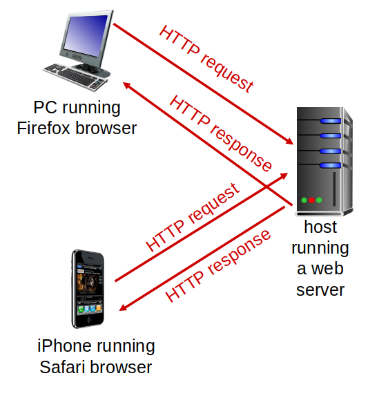</img>

---

# HTTP overview (continued)

- Uses TCP:
    - Client initiates TCP connection (creates socket) to server,  port 80
    - Server accepts TCP connection from client
    - HTTP messages (application-layer protocol messages) exchanged between browser (HTTP client) and Web server (HTTP server)
    - TCP connection closed

---

# HTTP overview (continued)

- HTTP is “stateless”
- Server maintains no information about past client requests  

### Protocols that maintain “state” are complex!
- Past history (state) must be maintained
- If server/client crashes, their views of “state” may be inconsistent, must be reconciled

---

# HTTP connections

- Non-persistent HTTP
    - At most one object sent over TCP connection
    - Connection then closed
    - Downloading multiple objects required multiple connections

- Persistent HTTP
    - Multiple objects can be sent over single TCP connection between client, server

---

# Non-persistent HTTP

Suppose a user enters an URL:
www.someSchool.ac.uk/computer.science/

- HTTP client initiates TCP connection to HTTP server at someSchool.ac.uk on <b> port 80</b>

1. HTTP server at host is waiting for TCP connections on port 80 and accepts to the connection notifying the client
2. HTTP client sends HTTP request message (containing URL) into the TCP connection socket. The message indicates the client wants e.g. computer.science/index.html

---

# Non-persistent HTTP (continued)

3. HTTP server receives request message, forms response message containing requested object, and sends message into its socket
4. HTTP server closes TCP connection as soon as the client received the response intact
5. HTTP client receives response message containing html file, displays html.  Parsing html file, finds 10 referenced objects (e.g., JPEG)
6. Steps 1-4 are repeated for each of the 10 jpeg objects

---

## Non-persistent HTTP: Response time

- <b> RTT (round-trip time): </b>
time for a small packet to travel from client to server and back

- <b> HTTP response time:</b>
    - One RTT to initiate TCP connection and one RTT for HTTP request and first few bytes of HTTP response to return
    - Non-persistent HTTP response time = 2RTT + file transmission

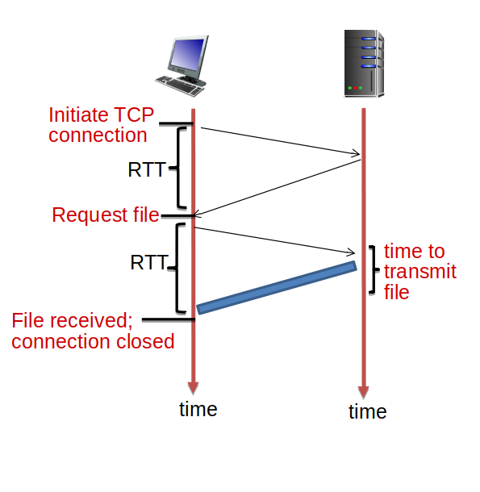</img>

---

# Persistent HTTP:
- Server leaves connection open after sending response

- Subsequent HTTP messages between same client/server sent over open connection

- Client sends requests as soon as it encounters a referenced object

- Persistent HTTP response time = RTT + file transmission
    - Assuming connections to server already established
    - Assuming all files requested in parallel

---

# Summary
- Application architectures
    - Client-server
    - P2P
- Application service requirements
- Internet transport service model
    - Connection-oriented, reliable: TCP
    - Unreliable, datagrams: UDP
- Application Layer Protocols
- HTTP
    - persistent HTTP
    - non-persisten HTTP

