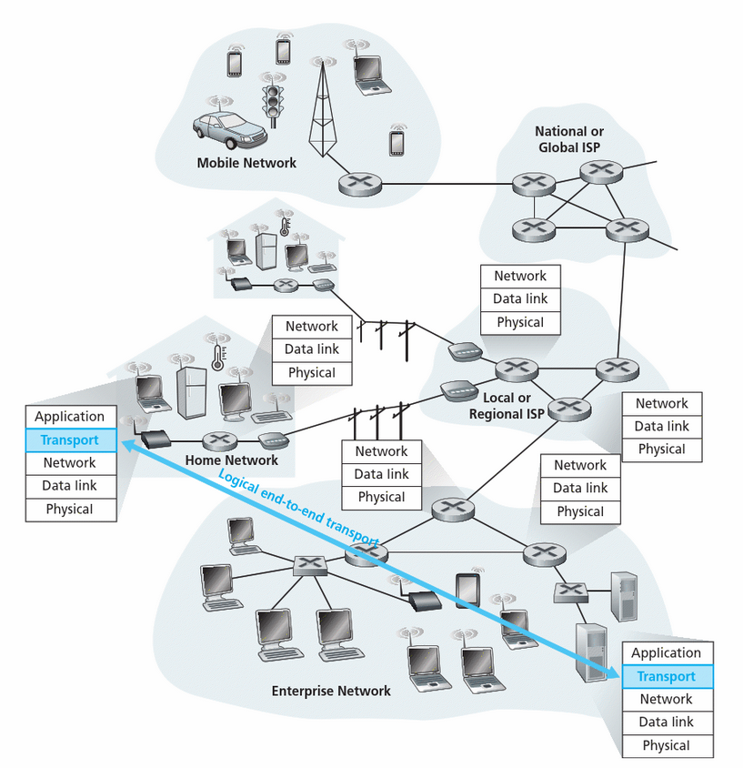
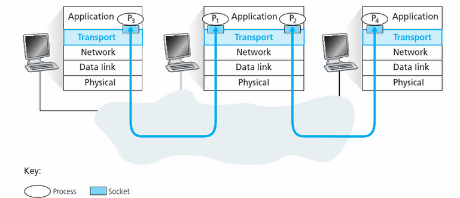
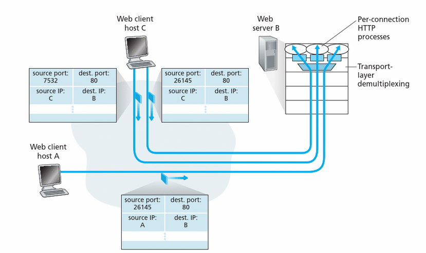
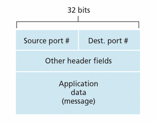
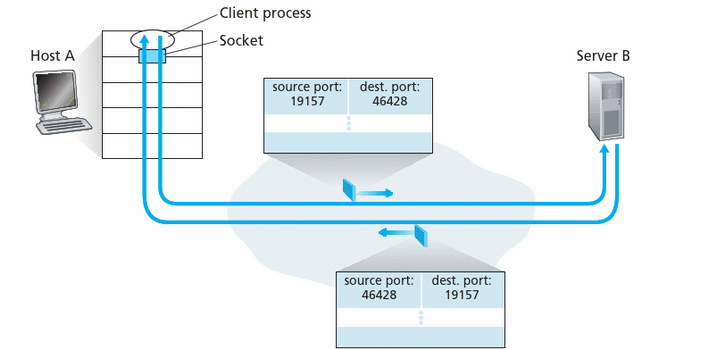
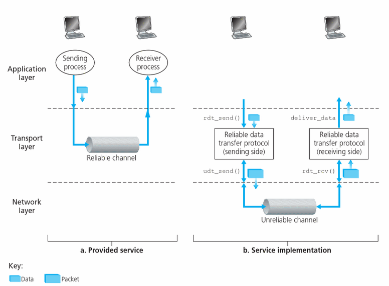

# Re-cap: Socket programming

- <b>Goal:</b> learn how to build client/server applications that communicate using sockets

- <b>Socket:</b> door between application process and end-end-transport protocol

---

# Re-cap: Socket programming

Two socket types for two transport services:
1. UDP: unreliable datagram
2. TCP: reliable, byte stream-oriented

---

# Re-cap: UDP

- UDP: no “connection” between client & server
    - No handshaking before sending data
    - Sender explicitly attaches IP destination address and port # to each packet
    - Receiver extracts sender IP address and port# from received packet
- UDP: transmitted data may be lost or received out-of-order
-  Application viewpoint:
    - UDP provides unreliable transfer of groups of bytes (“datagrams”)  between client and server

---

# Example app: UDP client

### Application Example:
1. Client reads a line of characters (data) from its keyboard and sends data to server
2. Server receives the data and converts characters to uppercase
3. Server sends modified data to client
4. Client receives modified data and displays line on the screen

---

# Example app: UDP client

<pre><code>import socket

def start_client():
    serverName = ""
    serverPort = 8800
    clientSocket = socket.socket(socket.AF_INET, socket.SOCK_DGRAM)

    message = input("Input lowercase sentence: ")

    clientSocket.sendto(message.encode(), (serverName, serverPort))
    modifiedMessage, serverAddress = clientSocket.recvfrom(1024)
    print(modifiedMessage.decode())
    clientSocket.close()

if __name__ == "__main__":
    start_client()
</code></pre>

---

# Example app: UDP server

<pre><code>import socket

def start_server():
    serverPort = 8800
    serverSocket = socket.socket(socket.AF_INET, socket.SOCK_DGRAM) 
    serverSocket.bind(("", serverPort))
    print("The server is ready to receive")
    while True: 
        message, clientAddress = serverSocket.recvfrom(1024)
        modifiedMessage = message.decode().upper() 
        serverSocket.sendto(modifiedMessage.encode(), clientAddress)

if __name__=="__main__":
    start_server()
</code></pre>

---

# Re-cap: TCP

### Application viewpoint:
- TCP provides reliable, in-order
byte-stream transfer (“pipe”) 
between client and serve

---

# Re-cap: TCP

- Server process must first be running and must have created socket that accepts client’s connection
- Client contacts server by:
    - Creating TCP socket, specifying IP address, port number of server process
    - When client creates socket: client TCP establishes connection to server TCP
- When contacted by client, server TCP creates new socket for server process to communicate with that particular client
    - Allows server to talk with multiple clients
    - Source port numbers used to distinguish clients

---

# Outline
- Transport-layer services
- Multiplexing and demultiplexing
- Connectionless transport: UDP
- Principles of reliable data transfer

---

# Re-cap: Layer Model

### <b>Application:</b> supporting network applications
- FTP, SMTP, HTTP

### <b>Transport:</b> process-process data transfer
- TCP, UDP

### <b>Network:</b> routing of datagrams
- IP, routing protocols

### <b>Link:</b> data transfer between neighboring network elements
- Ethernet, 802.11 (WiFi), PPP

### Physical: bits “on the wire”

---

# Transport services and protocols

- Provide logical communication between app processes running on different hosts
- Transport protocols run in end systems 
    - Send side: breaks app messages into segments, passes to  network layer
    - Recieve side: reassembles segments into messages, passes to app layer

- More than one transport protocol available to apps
    - Internet: TCP and UDP

---

## Transport services and protocols

</img>

---

# Transport vs. network layer

## Network layer: 

- Logical communication between hosts

## Transport layer:
- Logical communication between processes 
    -  Relies on & enhances network layer services

---

## Internet transport-layer protocols

#### TCP (Transmission Control Protocol)
- Reliable, in-order delivery
- Congestion control, flow control, ack., timer  
#### UDP (User Datagram Protocol)
- Unreliable, unordered delivery
- No-frills extension of IP  

TCP & UDP extend IP delivery service between hosts to deliver service between processes -> transport layer multiplexing and demultiplexing

---

# Multiplexing/demultiplexing

---

# Multiplexing/demultiplexing

#### Multiplexing at sender
- Handle data from multiple sockets, add transport header (later used for demultiplexing)  

#### Demultiplexing at receiver
- Use header info to deliver
received segments to correct 
socket

---

# Multiplexing/demultiplexing

</img>

---

# Multiplexing/demultiplexing
#### Example

- Host C initiates 2 HTTP  sessions to B
- Host A initiates 1 HTTP  session to B
- Server B demultiplexes  correctly as the two 
identical port numbers  come from different IP addresses

</img>

---

# TCP/UDP Segment format
- Host receives IP datagrams
- Each datagram has source IP address, destination IP address
- Each datagram carries one transport-layer segment
- Each segment has source, destination port number 

---

# TCP/UDP Segment format

- Host uses IP addresses 
& port numbers to direct  
segment to appropriate  socket
- Each socket has a unique identifier

</img>

---

# Connectionless multiplexing/demultiplexing
- All sockets have host-local port #
- Assigned automatically, or via <code>bind()</code>
- <code>serverSocket.bind((ip,port))</code>  

<b>Recall:</b> when creating datagram to send into UDP socket, must specify
destination IP address and  port #

---

# Connectionless multiplexing/demultiplexing

- When host receives UDP segment:
    - Checks destination port # in segment
    - Directs UDP segment to socket with that port #  

If two UDP segments have different source IP addresses and/or source port numbers but same dest. IP & port #, they will be directed to same process via same socket at destination

---

# Connectionless multiplexing/demultiplexing

<small>

- <code>serverSocket.bind((’’, 6428))</code>
- <code>clientSocket = socket(...)  #assigned port 9157</code>
- <code>clientSocket = socket(...)   #assigned port 5775</code>

</small>

</img>

---

# Reliable data transfer

---

# Reliable data transfer
- Important in application, transport, link layers
    - Top-10 list of important networking topics
- Characteristics of unreliable channel will determine the complexity of a reliable data transfer protocol (rdt)

---

# Reliable data transfer

</img>

---

# Reliable data transfer
- A reliable protocol (TCP) may be implemented on top of an unreliable end-to-end network layer (IP)
- Reliable transfer over UDP: 
    - Add reliability at application layer
    - Application-specific error recovery

---

# Summary

- Principles behind transport layer services
- Multiplexing, demultiplexing
- Connectionless transport 
- UDP: datagram protocol
- UDP segment format and checksum
- Connection-oriented transport
- Basic structure of reliable data transfer

