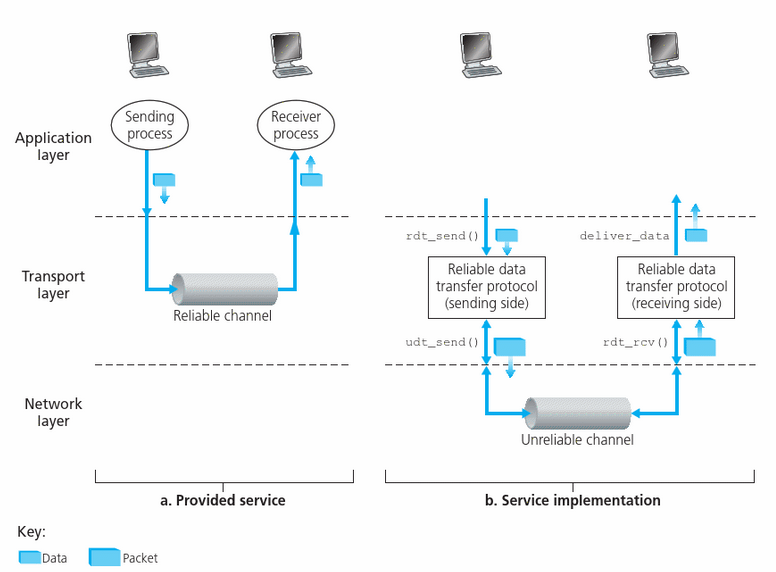

# Re-cap

- Transport-layer services
- Multiplexing and demultiplexing
- Connectionless transport: UDP
- Principles of reliable data transfer

---

# Re-cap: transport-layer services

- <b>Logical communication</b> between app processes running on different hosts
    - Run in end systems
    - TCP and UDP
        - TCP: reliable, in-order delivery, connection setup congestion control …
        - UDP: unreliable, unordered delivery, services not available, delay guarantees …

---

# Re-cap: 
#### Multiplexing and demultiplexing 
- Multiplexing: handle data from multiple sockets, add transport header (later used for demultiplexing)
- Demultiplexing: use header info to deliver received segments to correct socke

---

# Re-cap: reliable data transfer

</img>

---

# Outline
### Reliable data transfer

We will:
- Incrementally develop sender, receiver sides of reliable data transfer protocol (rdt)
- Consider only unidirectional data transfer
    - but control info will flow on both directions!
- Use finite state machines (FSM)  to specify sender, receiver

---

# rdt1.0: 
### reliable transfer over a reliable channel
- Underlying channel perfectly reliable
    - No bit errors
    - No loss of packets
- Separate FSMs for sender, receiver:
    - Sender sends data into underlying channel
    - Receiver reads data from underlying channel

---

# rdt2.0:
### channel with bit errors

- Underlying channel may flip bits in packet
    - use a checksum to detect bit errors

- The question: how to recover from errors:
    - Acknowledgements (ACKs): receiver explicitly tells sender that pkt received OK
    - Negative acknowledgements (NAKs): receiver explicitly tells sender that pkt had errors
    - Sender retransmits pkt on receipt of NAK
    - Using ACKs & NAKs is known as ARQ (Automatic Repeat reQuest) protocols.
        - Error detection. Sender embeds extra bits in packets
        - Feedback. Receiver provide sender with feedback
        - Retransmission. Retransmit erroneous packets

