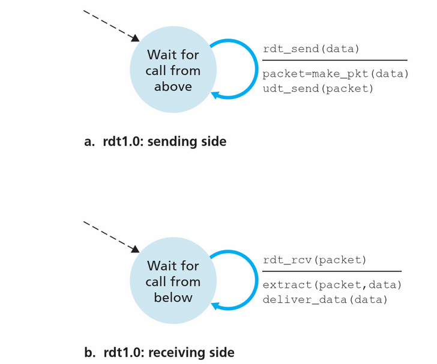
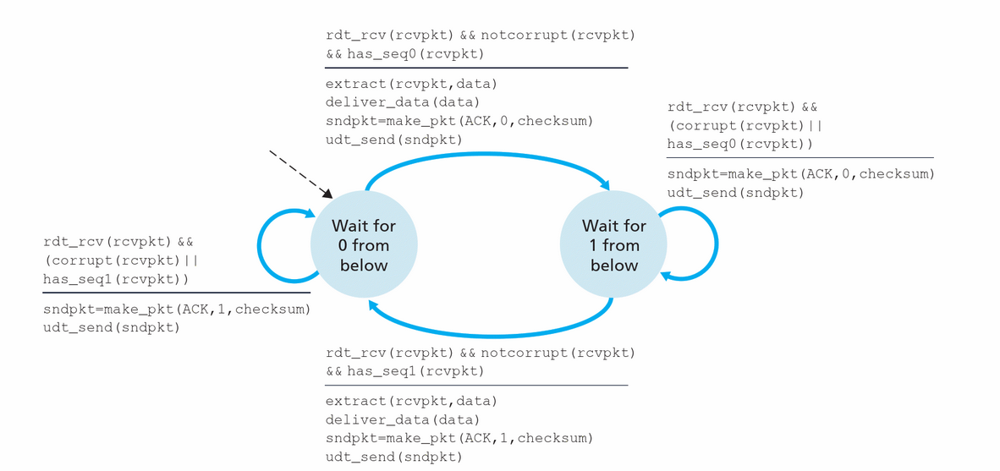
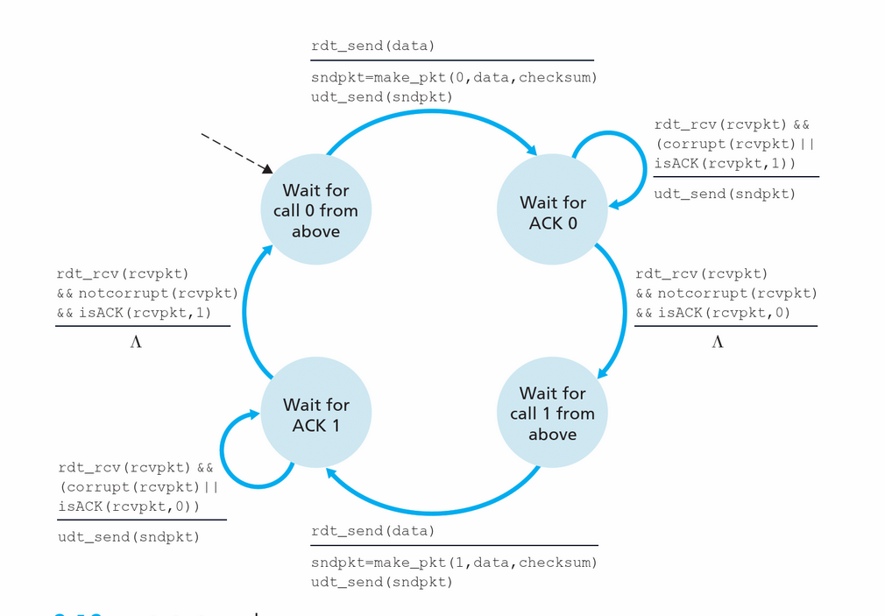

# Re-cap

- Transport-layer services
- Multiplexing and demultiplexing
- Connectionless transport: UDP
- Principles of reliable data transfer

---

# Re-cap: transport-layer services

- <b>Logical communication</b> between app processes running on different hosts
    - Run in end systems
    - TCP and UDP
        - TCP: reliable, in-order delivery, connection setup congestion control …
        - UDP: unreliable, unordered delivery, services not available, delay guarantees …

---

# Re-cap: 
#### Multiplexing and demultiplexing 
- Multiplexing: handle data from multiple sockets, add transport header (later used for demultiplexing)
- Demultiplexing: use header info to deliver received segments to correct socke

---

# Re-cap: reliable data transfer

</img>

---

# Outline
### Reliable data transfer

We will:
- Incrementally develop sender, receiver sides of reliable data transfer protocol (rdt)
- Consider only unidirectional data transfer
    - but control info will flow on both directions!
- Use finite state machines (FSM)  to specify sender, receiver

---

# rdt1.0: 
### reliable transfer over a reliable channel
- Underlying channel perfectly reliable
    - No bit errors
    - No loss of packets
- Separate FSMs for sender, receiver:
    - Sender sends data into underlying channel
    - Receiver reads data from underlying channel

---

# rdt1.0

</img>

---

# rdt1.0
- set up a sender
    - Implements a reliable transfer <code>rdt_send</code>
    - Uses an unreliable channel <code>udt_send</code>
- set up a receiver
    - Implements a reliable reciever <code> rdt_rcv</code>
- For now we do not lose/corrupt any packets

---

# rdt1.0

Go to: [github](https://github.com/annereinarz/comp2211-rdt)

---

# rdt2.0:
### channel with bit errors

- Underlying channel may flip bits in packet
    - use a checksum to detect bit errors

---

# rdt2.0:
### The question: how to recover from errors:
- Acknowledgements (ACKs): receiver explicitly tells sender that pkt received OK
- Negative acknowledgements (NAKs): receiver explicitly tells sender that pkt had errors
- Sender retransmits packet on receipt of NAK

---

# ARQ
- Using ACKs & NAKs is known as ARQ (Automatic Repeat reQuest) protocols.
   - Error detection. Sender embeds extra bits in packets
   - Feedback. Receiver provide sender with feedback
   - Retransmission. Retransmit erroneous packets

---

# rdt2.0
### New mechanisms in rdt2.0 (beyond rdt1.0):
- Error detection
- Feedback: control msgs (ACK (1), NAK (0)) from receiver to sender

---

# rdt2.0
### Two cases
1. no error: 
    - deliver message
    - send ACK
2. error (corrupt message)
    - send NAK

---

# rdt2.0

</img>

---

# rdt2.0 has a fatal flaw
### What happens if ACK/NAK corrupted?
- Sender doesn’t know what happened at receiver!
- Can’t just retransmit: possible duplicate

---

# rdt2.0 has a fatal flaw
- Handling duplicates: 
    - Sender retransmits current pkt if ACK/NAK corrupted
    - Sender adds sequence number to each pkt
    - Receiver discards (doesn’t deliver up) duplicate pkt  

#### Stop and wait
Sender sends one packet, then waits for receiver response

---

# rdt 2.1 and rdt 2.2

- Add checksum to ACK and NAK
- Add sequence number to avoid duplication

---

# rdt2.2: receiver

</img>

---

# rdt2.2: sender
</img>

---

# rdt3.0: 
## channels with errors and loss

<b> New assumption:</b> 
- underlying channel can also lose packets (data, ACKs)
    - Checksum, sequence #, ACKs, retransmissions will be of help... but not enough

---

# rdt3.0: 
## channels with errors and loss
- <b>Approach:</b> sender waits “reasonable” amount of time for ACK 
    - Retransmits if no ACK received in this time
    - If pkt (or ACK) just delayed (not lost):
        - Retransmission will be  duplicate, but seq. #’s already handles this
        - Receiver must specify seq # of pkt being ACKed
    - Requires countdown timer

---

# rdt3.0: sender
</img>

---

# rdt3.0

</img>

---

# rdt3.0

</img>

---

# Pipelined protocols

</img>

---

# Pipelined protocols
- Range of sequence numbers must be increased. 
    - Unique sequence number, and there may be multiple, in-transit, unacknowledged packets.
- Multiple packet buffering at sender and/or receiver
    - Sender buffers packets that have been transmitted but not yet acknowledged 
    - Buffering of correctly received packets 
- Range of sequence numbers needed and the buffering requirements will depend on the manner in which a data transfer protocol responds to lost, corrupted, and overly delayed packets

---

# Pipelined protocols
### Two generic forms of pipelined protocols:
1. go-Back-N,
2. selective repeat

---

# Go-back-N:
- Sender can send multiple packets without waiting for ACK.
- Sender can have up to N unacked packets in pipeline
- Receiver only sends cumulative ack
    - Doesn’t ack packet if there’s a gap
- Sender has timer for oldest unacked packet
    - when timer expires, retransmit all unacked packets

---

# Selective Repeat:
- Sender can have up to N unacked packets in pipeline
- Receiver sends individual ack for each packet
- Sender maintains timer for each unacked packet
    - When timer expires, retransmit only that unacked packet

---

# Go-back-N in action

</img>

---

# Selective repeat

- Receiver individually acknowledges all correctly received pkts
    - buffers pkts, as needed, for eventual in-order delivery to upper layer

- Sender only resends pkts for which ACK not received
    - Sender timer for each unACKed pkt

- Sender window
    - N consecutive seq #’s
    - Limits seq #s of sent, unACKed pkts

---

# Selective repeat

## Sender

- Data from above:
    - If next available seq # in window, send pkt
- <code>timeout(n)</code>:
    - Resend pkt n, restart timer
- <code>ACK(n) in [sendbase,sendbase+N]</code>:
    - Mark pkt n as received
    - If n smallest unACKed pkt, advance window base to next unACKed seq #

---

# Selective repeat

## Receiver

- <code>pkt n in [rcvbase, rcvbase+N-1]</code>
    - Send ACK(n)
    - Out-of-order: buffer
    - In-order: deliver (also deliver buffered, in-order pkts), advance window to next not-yet-received pkt
- <code>pkt n in [rcvbase-N,rcvbase-1]</code>
    - ACK(n)
- Otherwise: 
    - Ignore

---

# Selective repeat

</img>

---

# Selective repeat: dilemma

- Example: 
    - Finite range of seq #’s: 0, 1, 2, 3
    - Window size=3
        - Receiver sees no difference in two scenarios!
        - Duplicate data accepted as new in (b)

</img>

---

# Summary

- Principles of reliable data transfer
- Reliable data transfer protocols
- Pipeline protocol
- Go-Back-N protocol
- Selective repeat protocol
- Issues with protocols
