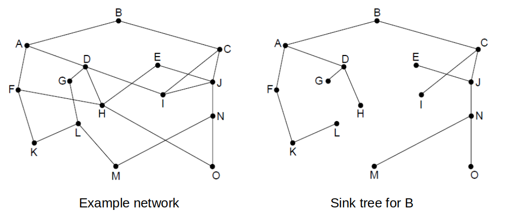
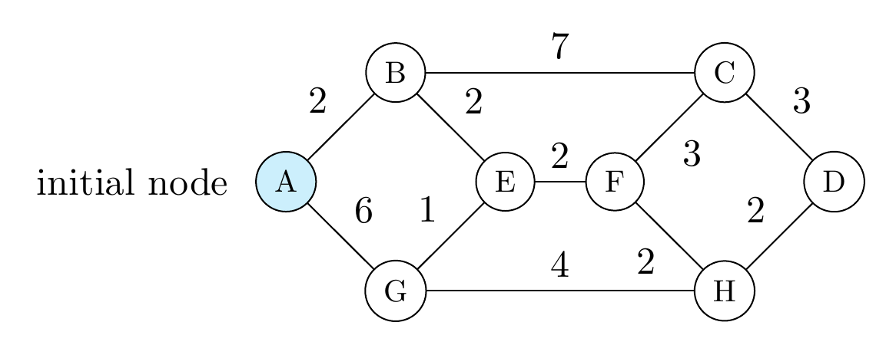
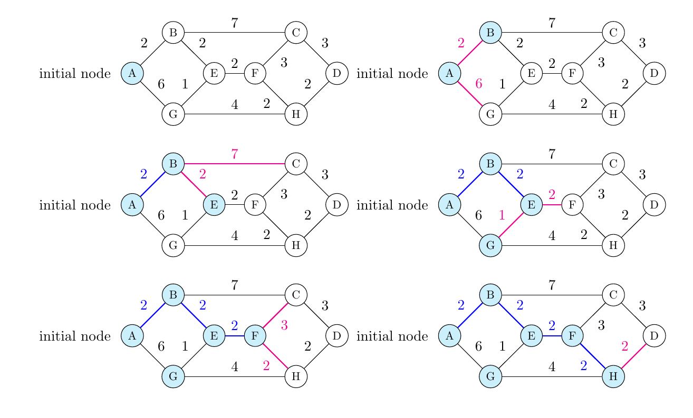
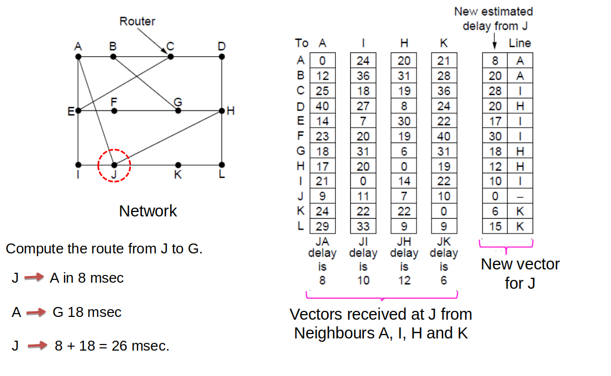
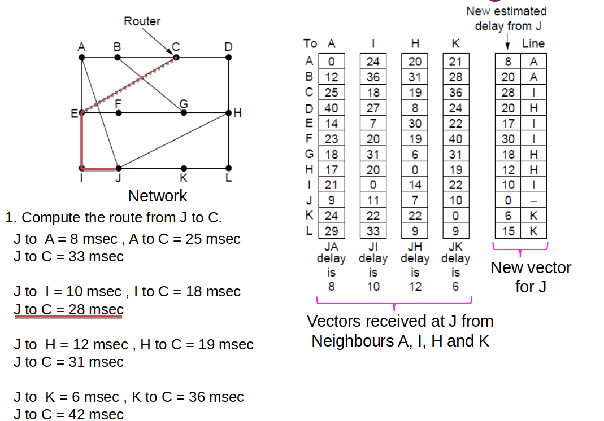
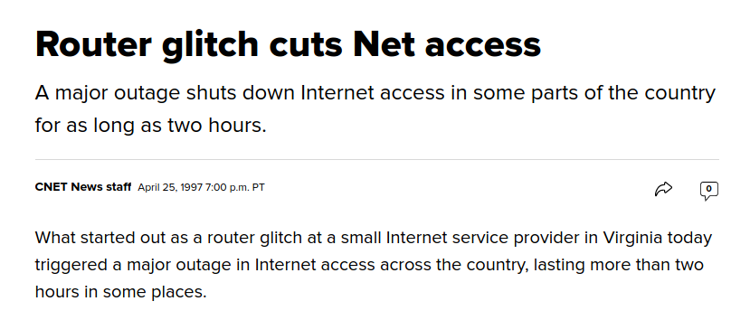
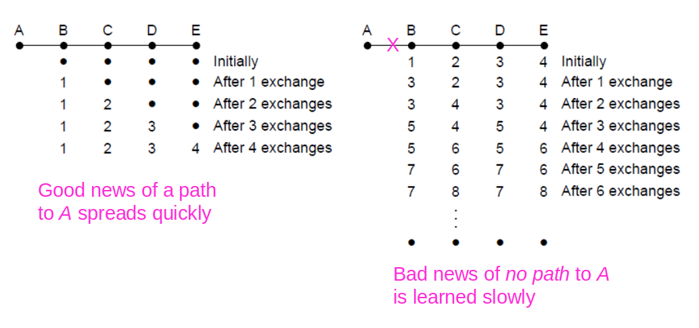
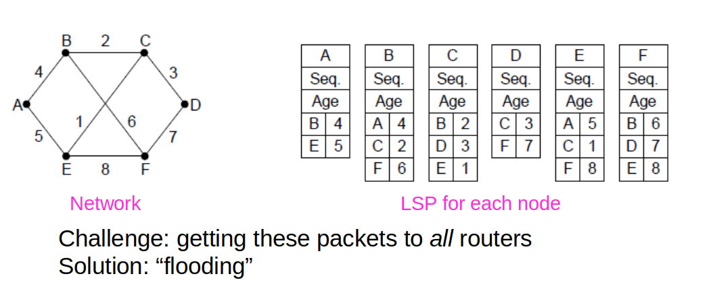
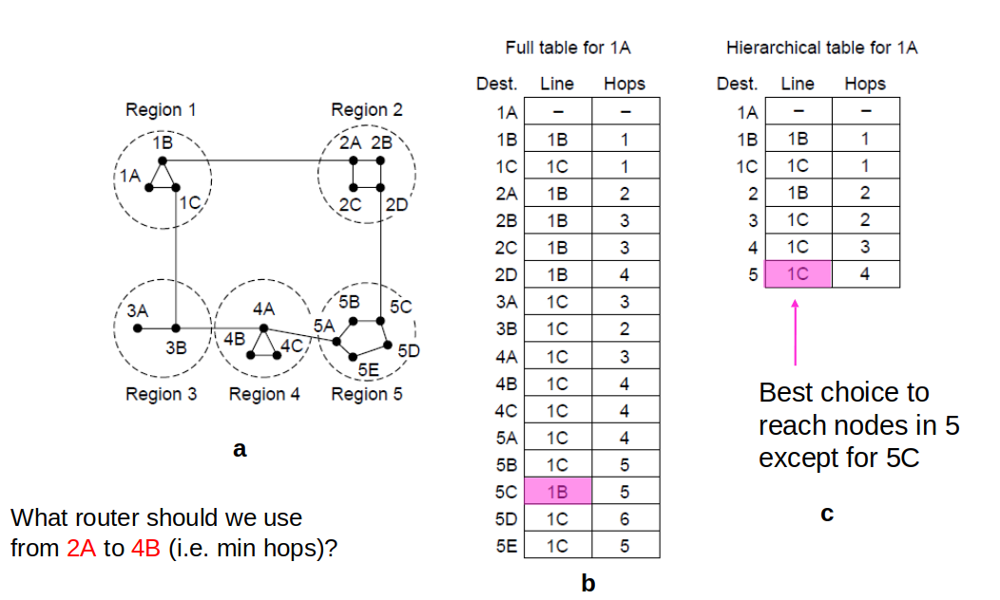
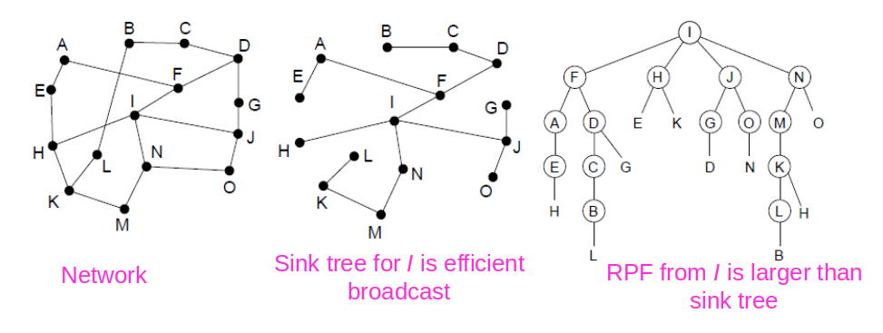

# Outline

- Routing algorithm: routing packets from source to destination.

- Optimality principle: finding the optimal path from source to destination.

- Various routing algorithms
    - Dijsktra’s algorithm
    - Dynamic routing algorithms:
        - Distance vector algorithm
        - Link state routing
    - Hierarchical routing

---

# Routing Algorithms

- Routing is the process of discovering network paths
    - Decide what to optimize (e.g., fairness vs efficiency)
    - Model the network as a graph of nodes and links
    - Update routes for changes in topology (e.g., failures)

---

# Optimality Principle

If router J is on the optimal path from I to K,
then the optimal path from J to K is on the same route

 

- Identify the optimal path from source to destination.
- Sink tree: optimal routes from all sources to a given destination.
- Distance metrics: 
    - the number of hops, or
    - time delay.

---

# Optimality Principle

</img>

---

# Shortest Path Algorithm

### Dijkstra’s algorithm computes a sink tree on the graph:
- Each node is labelled with its distance from the source node to the best known path
- Initially no paths are known
- Each link is assigned a non-negative weight/distance
- Shortest path is the one with lowest total weight

---

# Shortest Path Algorithm

### Algorithm:
- Start with sink, set distance at other nodes to infinity
- Labels tentative (○) or permanent (⚫), initially all tentative
- Pick lowest distance non-permanent node, make perm.
- Repeat from this node, until all nodes are permanent

---

# Shortest Path Algorithm

</img>

- weights represent cost/distance

---

# Shortest Path Algorithm

</img>

<small>

- A network and first five steps in finding the shortest paths from A to D. Pink arrows show the sink tree so far

</small>

---

# Distance Vector Routing
### Two types of dynamic routing algorithm:
1. Distance vector, and 
2. link state routing algorithms

---

# Distance Vector Routing
### Distance vector:
- Each node maintains a table (vector of best distance to dest.)
- Tables are updated by exchanging information between nodes
- Tables have 2 entries: outgoing line and estimated distance (#hops or propagation delay)

---

# Distance Vector Routing
### Algorithm:
- Each node knows distance of links to its immediate neighbours
- Each node advertises a vector of the lowest known distances to all nodes
- Each node uses received vectors to update its own
- Repeat periodically

---

# Distance Vector Routing

</img>

---

# Distance Vector Routing

</img>

---

# Black Holes

</img>

[Article](https://www.cnet.com/news/router-glitch-cuts-net-access/)

---

# The Count-to-Infinity Problem

- Failures can cause DV to “count to infinity” while seeking a path to an unreachable node

</img>

---

# Distance Vector Routing
### Link State Routing
1. Learn the network address of the neighbouring routers by sending HELLO packet, record name
2. Set the distance to each neighbour
3. Construct a packet telling all other routers what it has just learned
4. Send the packet to and receive packets from all other routers
5. Compute the shortest path by using Dijkstra’s algorithm

---

# Link State Routing: LSPs
- LSP (Link State Packet) for a node lists neighbours and weights of links to reach them

</img>

---

# Flooding

- A simple method to send a packet to all network nodes

- Each node floods a new packet received on an incoming link by sending it out on all of the other links

- Nodes need to keep track of flooded packets to stop the flood
    - E.g. by using sequence numbers

- Does not rely on routing tables being built first

---

# Hierarchical Routing

- Hierarchical routing reduces the work of route computation but may result in slightly longer paths than flat routing

</img>

---

# Broadcast Routing

- Broadcast sends a packet to all nodes
- RPF (Reverse Path Forwarding): Arrived packets are checked to see if they arrived from a preferred link, which is the link that is normally used for sending packets towards the source of the broadcast. 
- 1st hop: I sends packets to F, H, J, and N. Packets arrive on the same link that is used to send to I
- 2nd hop: 8 packets are generated, two by each router. 5 of them arrive on the preferred link
- ...

---

# Broadcast Routing

</img>

---

# Summary
- Packet routing algorithms
- Different routing algorithms
    - Dijsktra’s algorithm
    - Shortest path algorithm
    - Distance vector routing
    - Link state routing
    - Hierarchical routing
- Flooding
- Broadcasting

