# Recap: Distance Vector Routing

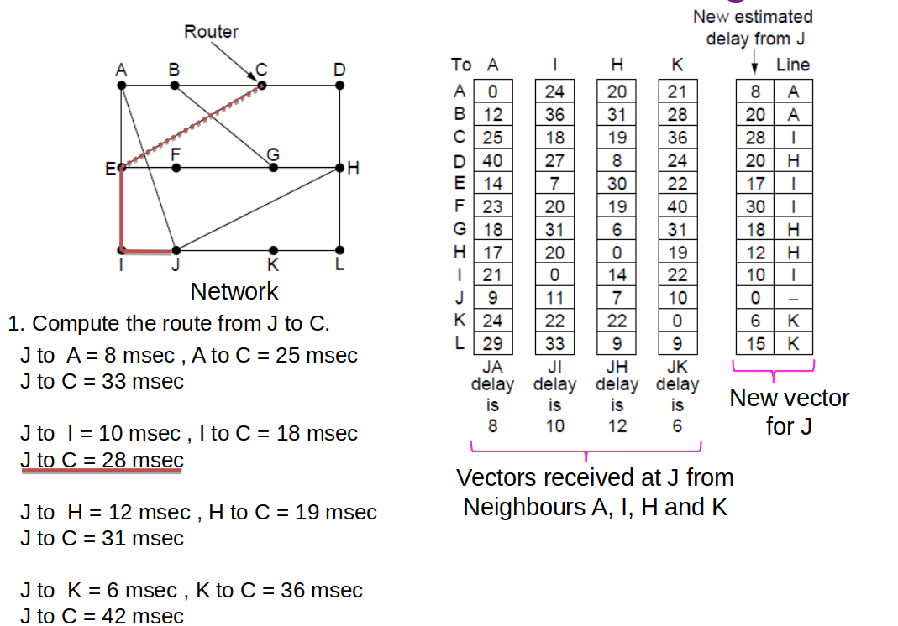</img>

---

# Recap: Distance Vector Routing

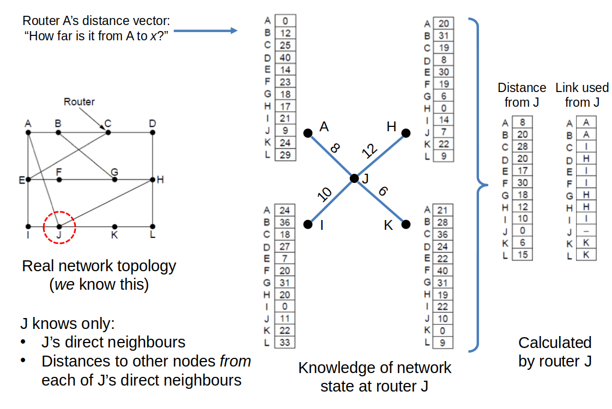</img>

---

# Recap: Count-to-Infinity Problem

  

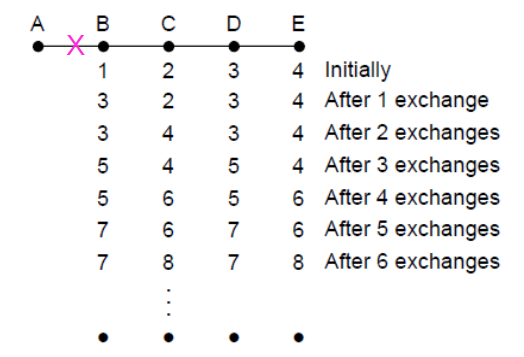</img>

<small>

### Core problem:
- B knows it has no direct link to A.
- C tells B it knows a route to A
- But (in fact) C’s route also relies on the (now broken) link from B
- No router knows that these old routes are invalid!
- Routers only have knowledge of local topology (i.e. own links

</small>

 
Bad news of no path to A is learned slowly

---

# Recap: Count-to-Infinity Problem

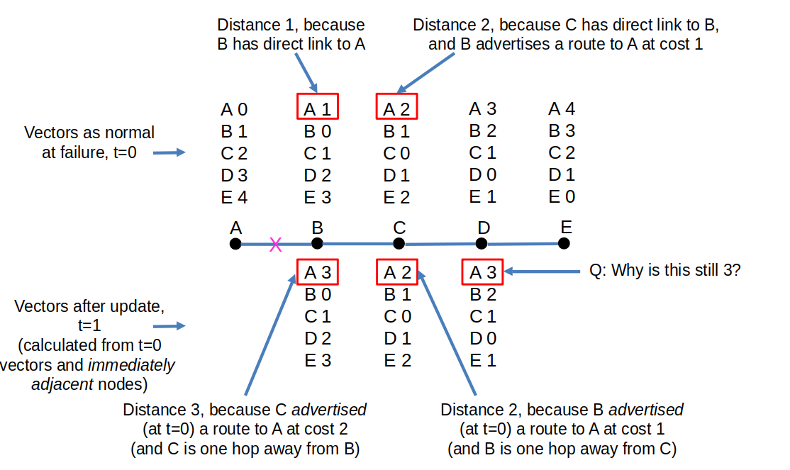</img>

---

# Recap: Link State Routing
- LSP (Link State Packet) for a node lists neighbours and weights of links to reach them

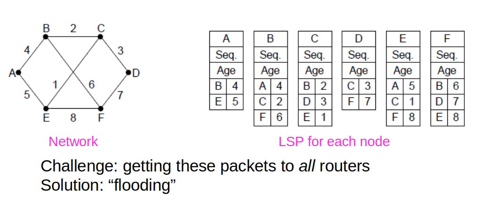</img>

---

# Recap: Flooding

- A simple method to send a packet to all network nodes

- Each node floods a new packet received on an incoming link by sending it out on all of the other links

- Nodes need to keep track of flooded packets to stop the flood
    - E.g. by using sequence numbers

- Does not rely on routing tables being built first

---

# Recap: Hierarchical Routing

- Hierarchical routing reduces the work of route computation but may result in slightly longer paths than flat routing

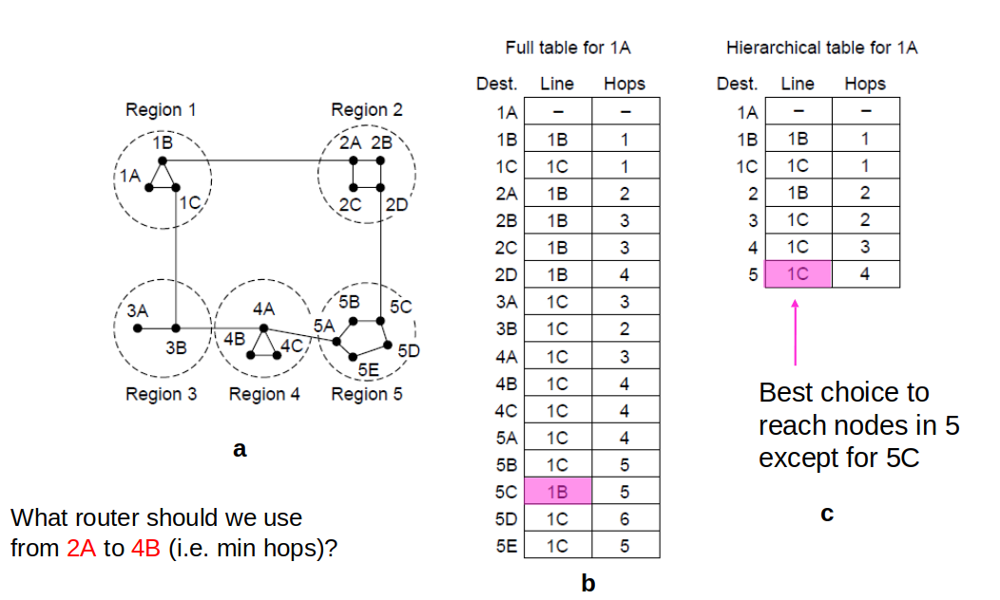</img>

---

# The MAC Sublayer

MAC is a layer responsible for determining who transmits next, i.e., who gets next access to the channel

---

# The MAC Sublayer

  

### <b>Application</b>

### <b>Transport</b>

### <b>Network</b>

### <b>Link:</b>
- Logical Link Control
- Medium Access Control (MAC)

### <b>Physical</b>

- Logical Link Control: Responsible for error control & flow control
- MAC: Responsible for multiple access resolutions

---

# Key issue:

We have a single physical layer medium for network communication...
it maybe a wire or it may be part of the wireless spectrum...
but multiple connected nodes (computers, phones, tablets, servers, intelligent devices) all want (or try) to use it at once to transmit / receive

---

# Why is this a problem ?

If two nodes transmit (“talk”) at the same time on the transmission medium the transmissions interfere with each other and become corrupted (“jumbled up”).

---

# Why is this a problem ?

- <b>Analogy</b>: two people talking over each other at the same place, same volume, same speed ...

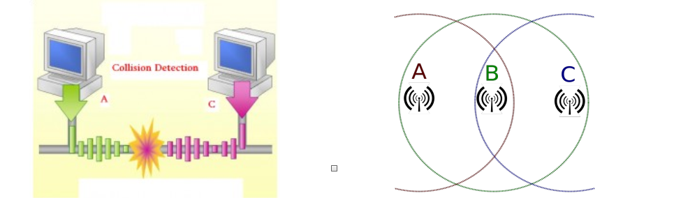</img>

---

# Channel Allocation Problem

#### Single channel is shared by several stations:
- This channel can be allocated to only one transmitting user at a time.

- Two different methods of channel allocation:
    - Static Channel Allocation
    - Dynamic Channel Allocation

---

# Static Channel Allocations

- In Time Division Multiplexing (TDM), each user gets the entire transmission capacity for a fixed time interval

- In Frequency Division Multiplexing (FDM), each user gets a portion of the transmission capacity for the whole time

---

# Static Channel Allocations

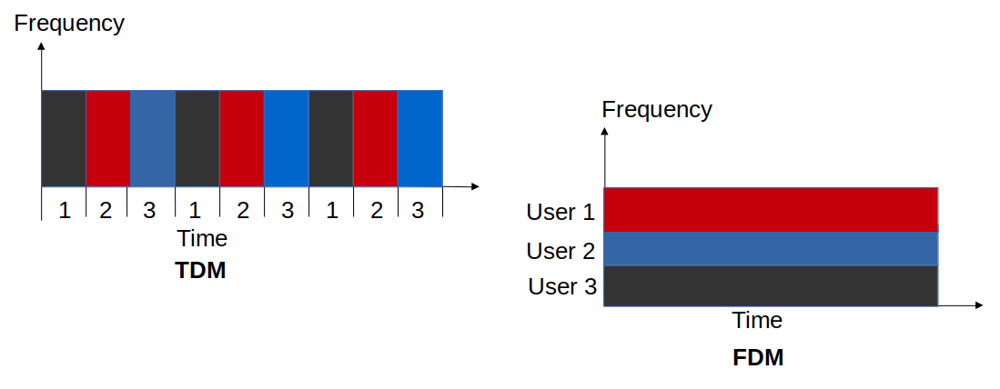</img>

---

# Static Channel Allocations

What are the limitations of static channel allocation?

---

# Static Channel Allocations

#### The limitations of static channel allocation:

- Works only for a fixed number of users

- Data traffic is very often bursty, i.e., long time no data and for a short time high data

- If many users do not use their allocated channel capacity, most of the channels will be idle most of the time

---

# Dynamic Channel Allocations

- In this method, no user is assigned fixed frequency or fixed time slot.

- All users are dynamically assigned frequency or time slot, depending upon the requirements of the user

---

# Dynamic Channel Allocations

- Random Access Protocols
    - E.g. ALOHA, CSMA, CSMA/CD

- Controlled Access Protocols
    - E.g. Bitmap, Token Passing, Binary Countdown

- Limited Contention Protocols
    - E.g. Adaptive Tree Walk

---

# Dynamic Channel Allocations
- Channelization Protocols
    - E.g. Frequency Division Multiple Access (FDMA),
    - Time Division Multiple Access (TDMA),
    - Code Division Multiple Access (CDMA)

---

# Random Access Protocols

- Also called Contention Methods because any station can send data at any time

- The station can make a decision on whether or not to send data. This decision may depend on the state of the channel, i.e. channel is busy or idle.

- There is no scheduled time for a station to transmit. They can transmit in any order.

---

# Random Access Protocols
- There is no rule that decides which station should send next
- If two stations transmit at the same time, there is a collision and the frames are lost

---

# Random Access Protocols

#### The various Random Access Protocols are:
- ALOHA
- CSMA (Carrier Sense Multiple Access)
- CSMA/CD (Carrier Sense Multiple Access with Collision Detection)
- CSMA/CA (Carrier Sense Multiple Access with Collision Avoidance)

---

# ALOHA
- Protocol developed for communication over radio link

- Collision occurs when two stations transmit simultaneously

- Two versions of ALOHA:
    1. Pure ALOHA
    2. Slotted ALOHA

---

# Pure ALOHA
- Stations transmit frames whenever they have data to send.
- Collisions
    - When two stations transmit simultaneously, there is a collision and frames are lost.
    - Whenever two frames try to occupy the channel at the same time, there is a collision and both the frames are lost
    - If the first bit of a new frame overlaps with the last bit of a frame, both frames will be lost and both will have to be retransmitted

---

# Pure ALOHA

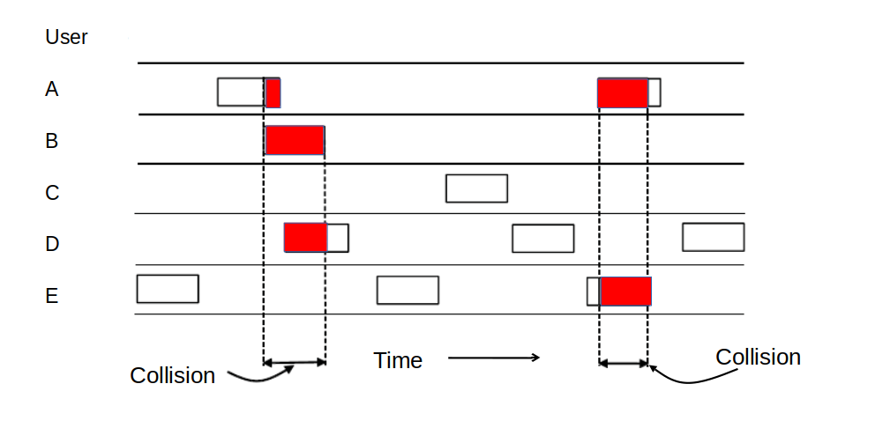</img>

---

# Slotted ALOHA

- In slotted ALOHA, the time is divided to frame-size slots.

- A station can send a frame only at the beginning of the slot, and only one frame is sent in each slot.

- If any station is not able to place the frame onto the channel at the beginning of the slot, it has to wait until the next time slot.

- There is still a possibility of collision if two stations try to send at the beginning of the same time slot

---

# Slotted ALOHA

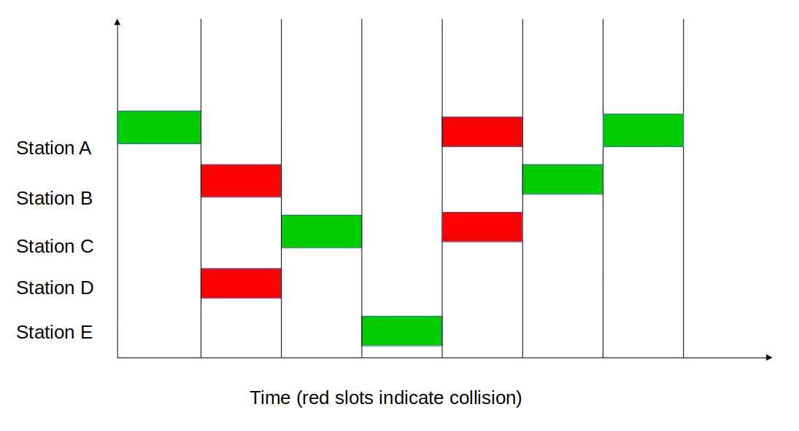</img>

---

# Carrier Sense Multiple Access (CSMA)

- CSMA was developed to overcome the problems of ALOHA i.e. to minimize the chances of collision

---

# Carrier Sense Multiple Access (CSMA)

#### CSMA is based on the principle of “carrier sense”:

- The station senses the carrier or channel before transmitting a frame

- That means the station checks whether the channel is idle or busy

    - Busy: don't send

- Chances of collision reduce greatly if a station checks the channel before trying to use it

---

# Carrier Sense Multiple Access (CSMA)
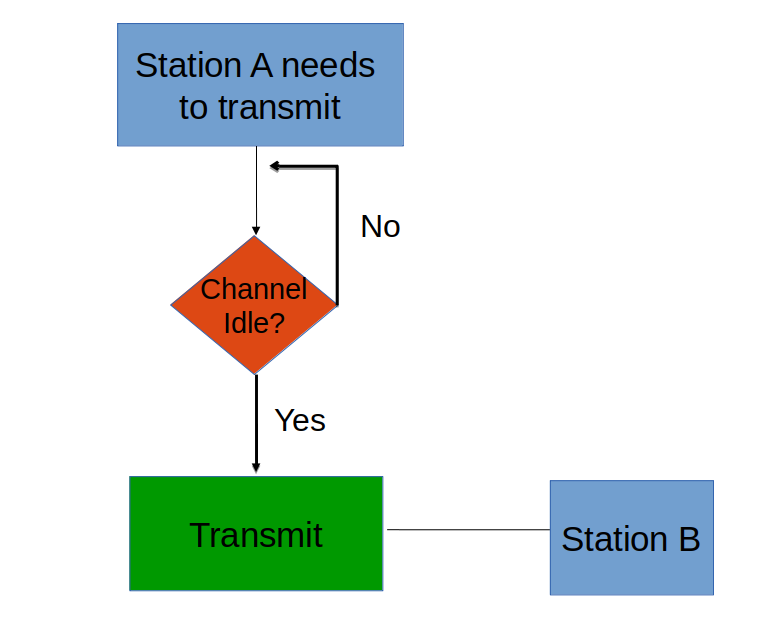</img>

---

# Carrier Sense Multiple Access (CSMA)
- Chance of collision still exists because of propagation delay

- A frame transmitted by one station takes sometime to reach the other station

- In the meantime, other station may sense the channel to be idle and transmit a frame

- This results in a collision

---

# Carrier Sense Multiple Access (CSMA)

- Station does not send if it senses someone else is using the channel. 

- There are three different types of CSMA protocols:
 1. 1-persistent (greedy): sends as soon as idle
 2. Non-persistent: waits a random time then tries again
 3. p-persistent: sends with probability p when idle

---

# 1-Persistent CSMA

- In this method, station that wants to transmit data, continuously senses the channel to check whether he channel is idle or busy.

    - If the channel is busy, station waits until it becomes idle.

    - When the station detects an idle channel, it immediately transmits the frame.

    - When a collision occurs, the station waits a random amount of time and starts all over again.

---

# 1-Persistent CSMA

- This method has the highest chance of collision because two or more stations may find channel to be idle at the same time, and then will transmit their frames at the same time
- 1-persistent: stations transmit with probability of 1 when channel is idle

---

# 1-Persistent CSMA

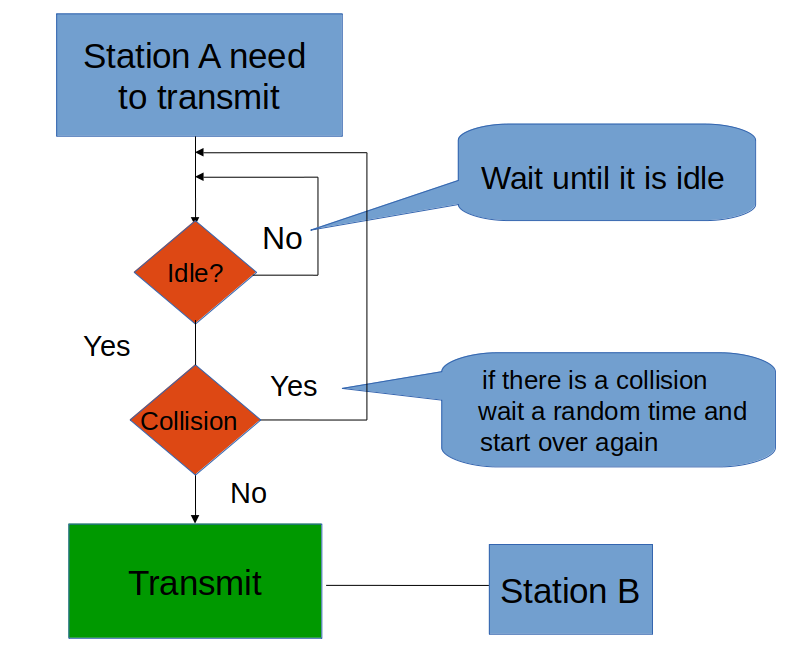</img>

---

# Non-Persistent CSMA
- A station that has a frame to send senses the channel
    - If the channel is idle, it sends immediately
    - If the channel is busy, it waits a random amount of time and then senses the channel again
- Reduces the chance of collision because the stations wait for a random amount of time
- Unlikely that two or more stations will wait for the same amount of time and will retransmit at the same time
- Introduces longer delays

---

# Non-Persistent CSMA
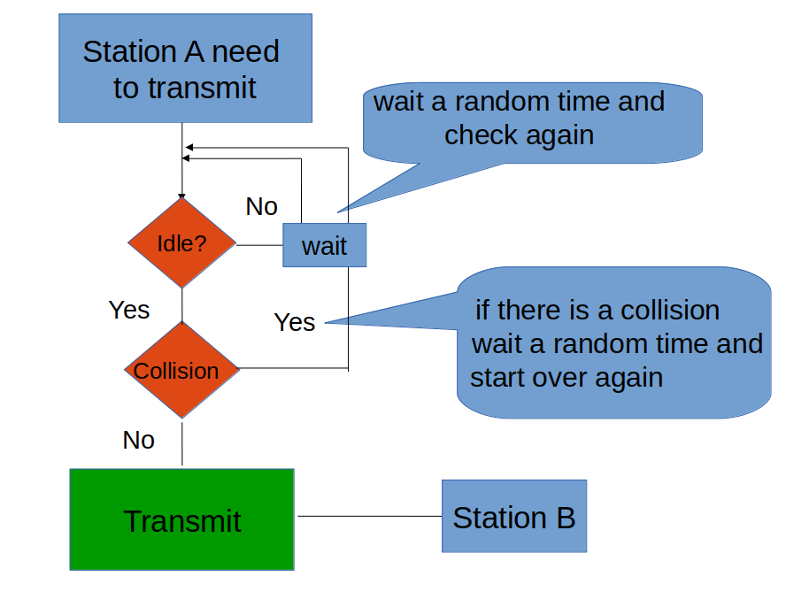</img>

---

# P-Persistent CSMA
- Used in slotted channels (slotted ALOHA)
    - Sense the channel
    - <code>IF</code> the channel is busy, <code>THEN</code> wait until the next time slot and start over
    - <code>IF</code> the channel is idle, <code>THEN</code> with probability p transmit and with probability (1-p) defer until the next slot and start over

---

# Open Question:

#### What do we do if in spite of sensing a collision occurs?

---

# CSMA/CD

- In <em>Carrier Sense Multiple Access with Collision Detection</em> , the station that sends its data on the channel, continues to sense the channel while data is transmitted.
    - If collision is detected, the station aborts its transmission and waits for a random amount of time & sends its data again.
    - As soon as a collision is detected, the transmitting station releases a jam signal. 
- Jam signal alerts other stations. Stations are not supposed to transmit immediately after the collision has occurred.

---

# CSMA/CD

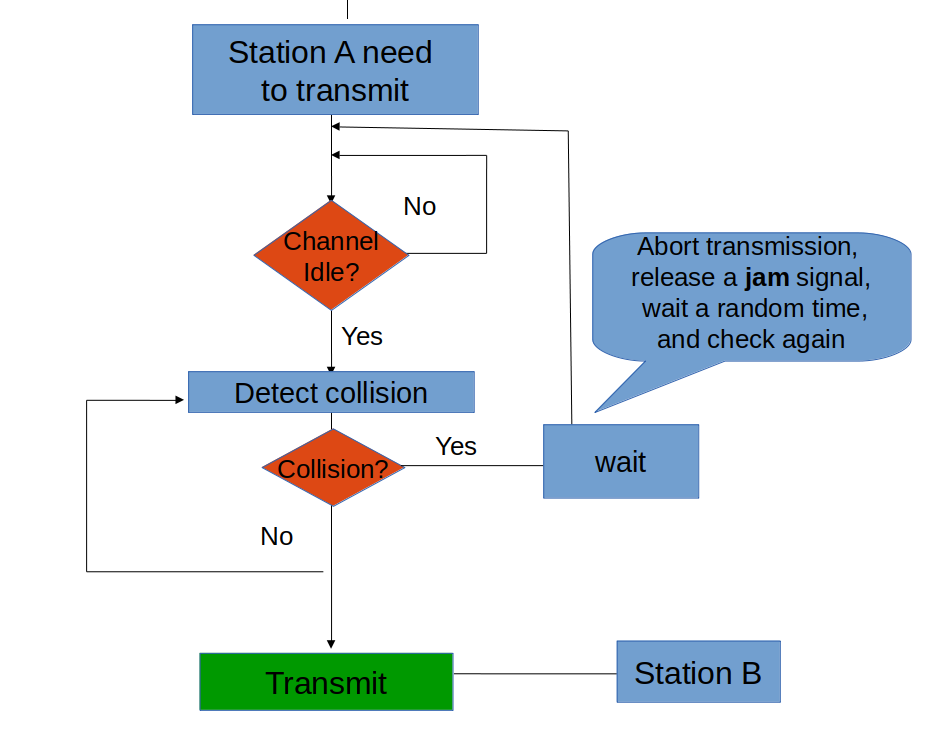</img>

---

# CSMA/CD
- CSMA/CD improvement is to detect/abort collisions

    - Reduced contention times improve performance

    - A station who detects a collision immediately stops transmitting

    - Afterwards it waits a random time and tries again

---

# Throughput by protocol

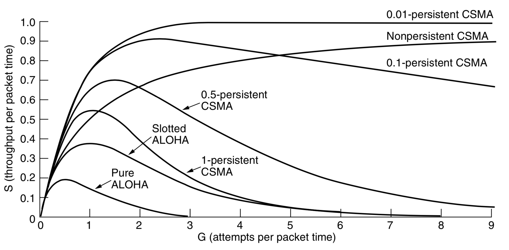</img>

---

# Controlled Access Protocols (CAP)

- In these protocols, the stations consult each other to find which station has a right to send

- They are collision-free protocols

- A station cannot send unless it has been authorize by other station(s)

- Types of controlled access protocol:
    - Bitmap
    - Token Passing
    - Binary Countdown

---

# CAP (1) – Bitmap
- Collision-free protocols avoid collisions entirely
    - Senders must know when it is their turn to send

---

# CAP (1) – Bitmap

#### The basic bit-map protocol, or reservation protocol:
- Before sending any data, all stations state if they have data
- Senders 0,1,2,…n send their status one-by-one, in order
    - I.e. sender sets a bit in “contention slot” if they have data
- Senders which announced they had data send in turn
- Repeat

---

# CAP (1) - Bitmap

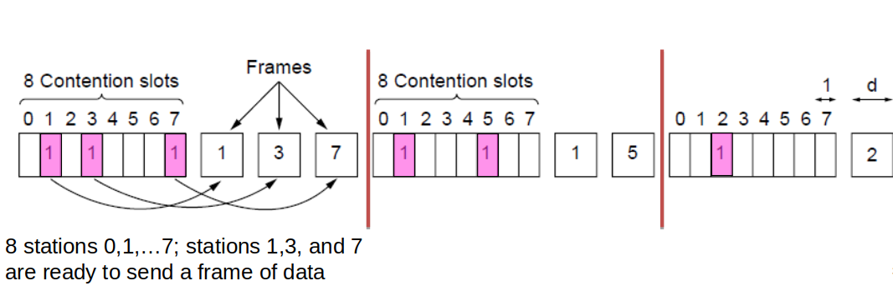</img>

---

# CAP (2) - Token Passing

- Tokes sent round ring defines the sending order
    - Station with token MAY send a frame before passing the token

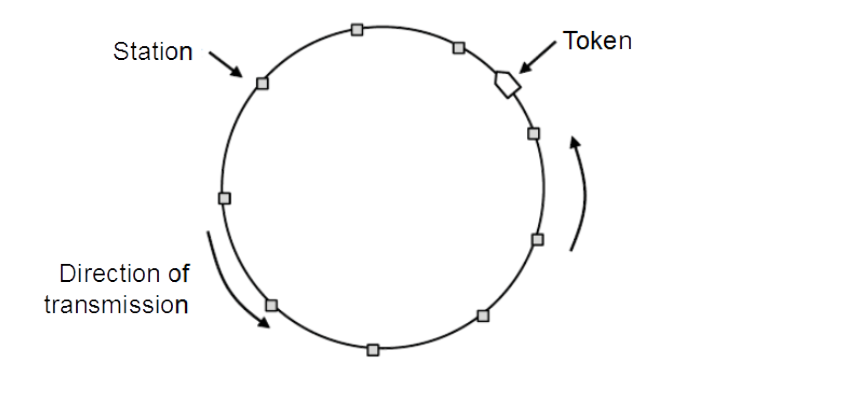</img>

---

# CAP (3) - Binary Countdown

- Binary countdown improves on the bitmap protocol
    - Stations send their address in contention slot
    - The channel ORs bits; stations give up when they send a “0” but see a “1”
    -Station that sees its full address is next to send

---

# Binary Countdown: Example

  

E.g. suppose stations have
4-bit addresses, and stations
0010, 0100, 1001, and 1010
wish to transmit

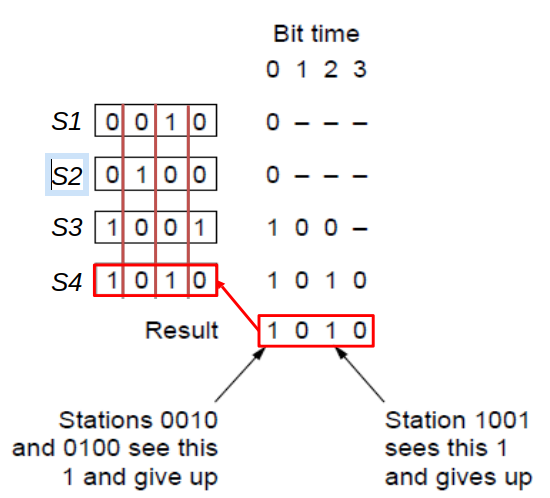

---

# Summary

- Common access to a single medium of transmission using static or dynamic channel allocation

- Discussed various protocols, such as random access, controlled access, and limited contention

