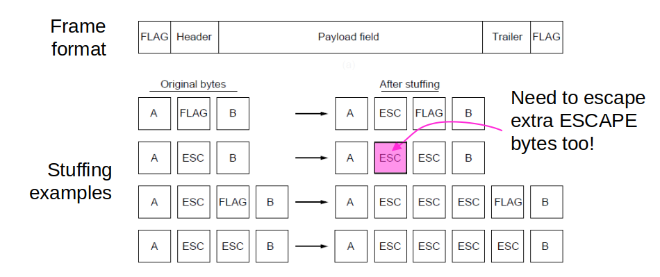

# Recap: Dynamic Channel Allocations

- Random Access Protocols
    - E.g. ALOHA, CSMA, CSMA/CD

- Controlled Access Protocols
    - E.g. Bitmap, Token Passing, Binary Countdown

---

# Outline

<small>

  

Type of data

Expected problems with data:

messages for processes

### <b>Application</b>

Depends on protocol (TCP/UDP)

messages for hosts

### <b>Transport</b>

Package Loss/Corruption/Out of order delivery

data for link

### <b>Network</b>

Package Loss

stream of bits

### <b>Link</b>

Individual Bit flips/ number of bits might change

signals in a medium

### <b>Physical</b>

signals degrade or interfered with

</small>

---

# Outline

- Framing
    - Byte count
    - Flag bytes with byte stuffing
    - Flag bits with bit stuffing

- Error Control
    - Error correction
    - Error detection

---

# Frames

- Link layer accepts packets from the network layer, and encapsulates them into frames that it sends using the physical layer; reception is the opposite process
- The Physical layer (below) is responsible for the transmission of raw sequences of bits

---

# Frames

</img>

---

# Framing Methods

- Byte count

- Flag bytes with byte stuffing

- Flag bits with bit stuffing

---

# Framing: Byte count 

- Frame begins with a count of the number of bytes in it
    - Simple, but difficult to resynchronize after an error

</img>

---

# Data Framing – Headers and Trailers

- We add a header (e.g. the length of data, etc.) and a trailer (extra data that can be used for e.g. error-detection or error-correction).  

FLAG

Header

Payload Field

Trailer

FLAG

 

### Open Question:
What happens if the flag value is found (i.e. naturally occurs) in the data?

---

# Framing: Byte stuffing

- Special flag bytes delimit frames; occurrences of flags in the data must be stuffed (escaped)
    - Longer, but easy to resynchronize after error

</img>

---

# Framing: Byte stuffing

</img>
- Byte sequences before and after stuffing for a different special byte - escape!

---

# Framing: bit stuffing

</img>

- The flag is six consecutive ones. 
Within the data, a zero is stuffed after each five consecutive ones to void instances of the flag in the data.
<ol style="list-style-type:lower-alpha">
<li> The original data</li>
<li> The data as they appear on the line</li>
<li> The data as stored by receiver after de-stuffing</li>
</ol>

---

# Framing: bit stuffing

</img>

### Sender: 
- encloses packet (bit stream) with flag: 0 1 1 1 1 1 1 0 
- appends a 0 after each 1 1 1 1 1 in body (bit stuffing)

---

# Framing: bit stuffing

</img>

### Receiver, upon receiving 0 1 1 1 1 1: 
- next bit 0: stuffed bit is removed
- next bit 1: 
    - if next bit 0 (i.e. 0 1 1 1 1 1 1 0): end of frame marker
    - if next bit 1 (i.e. 0 1 1 1 1 1 1 1): error

---

# Error Detection and Correction (EDC)
### Errors occur during frame transmission

### Two strategies to deal with error:
1. Include enough redundant information to help receivers deduce original data (error correcting)
2. Include enough information to deduce an error occurred (error detecting)
- Neither error-correcting codes nor error-detecting codes can handle all possible errors

---

# Error Detection and Correction
- EDC  = Error Detection and Correction bits
- D    = Data protected by error checking, may include header fields 

</img>

---

# Error Detection and Correction
- Error detection not 100% reliable:
    - a protocol may miss some errors, but rarely

### Example

</img>

---

# Codewords

- A frame consists of m data (message) bits and r redundant (check) bits.
- n-bit codewords with n =m+r

- ASCII code for “A”: 1000001
- codeword for “A”: 10000010  (r=1)

---

# Error Bounds – Hamming distance 

The number of bit positions in which two codewords differ is called the Hamming distance between these two codewords.

---

# Error Bounds – Hamming distance

#### Example with 2 codewords:
- Codeword #1:  1 0 0 0 1 0 0 1 
- Codeword #2:  1 0 1 1 0 0 0 1

- Hamming distance is 3. The number of bit positions in which two codewords differ

---

# Error Detection and Correction
### Hamming distance

<b> Step 1:</b> Ensure the two strings are of equal length.
- Codeword #1:  1  0   0   0   1   0   0  1 
- Codeword #2:  1  0   1   1   0   0   0  1

---

# Error Detection and Correction
### Hamming distance

<b>Step 2:</b> Compare the first two bits in each codeword (XOR them). If they are the same, record a "0" for that bit. If they are different, record a "1" for that bit.  Repeat the process for the remaining bits. 
- Codeword #1:  1  0   0   0   1   0   0  1 
- Codeword #2:  1  0   1   1   0   0   0  1
- Record:       0  0   1   1   1   0   0  0 

---

# Error Detection and Correction
### Hamming distance

<b>Step 3:</b> Add all the ones and zeros in the record together to obtain the Hamming distance. 
- Hamming distance = 0 + 0 + 1 + 1 + 1 + 0 + 0 + 0 = 3
- OR, count the number of 1s in the record. Three 1 bits in the record. i.e., Hamming distance is 3

---

# Hamming Codes

### Encoding: 
- We number the data bits starting from one and skipping the powers of two. The powers of two are reserved for parity bits. The rest are for message bits.

### Decoding: 
- Calculate all parities. If they are all OK, there was no error. If not, add up the positions of the incorrect ones- this gives us the position of the error

---

# Error Correction – Hamming code
The Hamming code gives a simple way to add check bits and correct up to a single bit error:
- Check bits are parity over subsets of the codeword
- Recomputing the parity sums (syndrome) gives the position of the error to flip, or 0 if there is no error

---

# Error Correction – Hamming code

</img>

---

# Error Correction – Hamming code

0   0   1   0    0   0   0    1    0    0   1  (original codeword)

0   0   1   0    1   0   0    1    0    0   1  (received codeword)

---

# Error Correction – Hamming code

0   0   1   0    0   0   0    1    0    0   1  (original codeword)

- step #1: number the bits

1 2 3 4 5 6 7 8 9 10 11

0   0   1   0    1   0   0    1    0    0&nbsp&nbsp   1&nbsp  (received codeword)

---

# Error Correction – Hamming code

0   0   1   0    0   0   0    1    0    0   1  (original codeword)

- step #2: allocate parity bits and message bits- powers of 2 bits are parity bits and the rest are message bits

p1 p2 m3 p4 m5 m6 m7 p8 m9 m10 m11

0 &nbsp   0 &nbsp  1  &nbsp &nbsp 0 &nbsp &nbsp  1  &nbsp&nbsp 0  &nbsp&nbsp 0  &nbsp&nbsp  1  &nbsp&nbsp  0  &nbsp&nbsp  0  &nbsp&nbsp&nbsp&nbsp&nbsp 1  &nbsp&nbsp&nbsp (received codeword)

---

# Error Correction – Hamming code

0   0   1   0    0   0   0    1    0    0   1  (original codeword)

- step #3: finding the parity bits

p1 p2 m3 p4 m5 m6 m7 p8 m9 m10 m11

0 &nbsp   0 &nbsp  1  &nbsp &nbsp 0 &nbsp &nbsp  1  &nbsp&nbsp 0  &nbsp&nbsp 0  &nbsp&nbsp  1  &nbsp&nbsp  0  &nbsp&nbsp  0  &nbsp&nbsp&nbsp&nbsp&nbsp 1  &nbsp&nbsp&nbsp

- Finding p1:
    - Count one bit and skip one, starting from p1 but not including p1 value.
    - Add the 1s. If the result is even then p1 parity is 0, if the result is odd then p1 parity is 1.
    - p1 is? 1   1   0   0   1 &rightarrow; 1

---

# Error Correction – Hamming code

0   0   1   0    0   0   0    1    0    0   1  (original codeword)

- step #3: finding the parity bits

p1 p2 m3 p4 m5 m6 m7 p8 m9 m10 m11

0 &nbsp   0 &nbsp  1  &nbsp &nbsp 0 &nbsp &nbsp  1  &nbsp&nbsp 0  &nbsp&nbsp 0  &nbsp&nbsp  1  &nbsp&nbsp  0  &nbsp&nbsp  0  &nbsp&nbsp&nbsp&nbsp&nbsp 1  &nbsp&nbsp&nbsp

- Finding p2:
    - Count two bits and skip two, starting from p2 but not including p2 value.
    - Add up the result. If the result is even then p2 parity is 0, if the result is odd then p2 parity is 1
    - p2 is? 1   0   0   0   1 &rightarrow; 0

---

# Error Correction – Hamming code

0   0   1   0    0   0   0    1    0    0   1  (original codeword)

- step #3: finding the parity bits

p1 p2 m3 p4 m5 m6 m7 p8 m9 m10 m11

0 &nbsp   0 &nbsp  1  &nbsp &nbsp 0 &nbsp &nbsp  1  &nbsp&nbsp 0  &nbsp&nbsp 0  &nbsp&nbsp  1  &nbsp&nbsp  0  &nbsp&nbsp  0  &nbsp&nbsp&nbsp&nbsp&nbsp 1  &nbsp&nbsp&nbsp

- Finding p4:
    - Count four bits and skip four, starting from p4 but not including p4 value.
    - Add up the result. If the result is even then p4 parity is 0, if the result is odd then p4 parity is 1.
    - p4 is  ?   1   0   0   -    -  &rightarrow; 1

---

# Error Correction – Hamming code

0   0   1   0    0   0   0    1    0    0   1  (original codeword)

- step #3: finding the parity bits

p1 p2 m3 p4 m5 m6 m7 p8 m9 m10 m11

0 &nbsp   0 &nbsp  1  &nbsp &nbsp 0 &nbsp &nbsp  1  &nbsp&nbsp 0  &nbsp&nbsp 0  &nbsp&nbsp  1  &nbsp&nbsp  0  &nbsp&nbsp  0  &nbsp&nbsp&nbsp&nbsp&nbsp 1  &nbsp&nbsp&nbsp

- Finding p8:
    - Count eight bits and skip eight, starting from p8 but not including p8 value.
    - Add up the result. If the result is even then p8 parity is 0, if the result is odd then p8 parity is 1.
    - p8 is  ?   0   0   1   -    -  &rightarrow; 1  

---

# Error Correction – Hamming code

0   0   1   0    0   0   0    1    0    0   1  (original codeword)

- step #4: compare our result with the received parity bits.

0 &nbsp   0 &nbsp  1  &nbsp &nbsp 0 &nbsp &nbsp  1  &nbsp&nbsp 0  &nbsp&nbsp 0  &nbsp&nbsp  1  &nbsp&nbsp  0  &nbsp&nbsp  0  &nbsp&nbsp&nbsp&nbsp&nbsp 1  &nbsp&nbsp&nbsp

- p1 is  0   1   1   0   0   1 → 1 ✘  
- p2 is  0   1   0   0   0   1 → 0 ✔ 
- p4 is  0   1   0   0   -    -  → 1 ✘
- p8 is  1   0   0   1   -    -  → 1 ✔ 

- p1+p4 &rightarrow; in position 5

---

# Error Detection

### Three types of error detection codes:

1. Parity
2. Checksums
3. Cyclic redundancy codes

---

# Error Detection – Parity

- Parity bit is added as the modulo 2 sum of data bits
    - Equivalent to XOR; this is an odd parity
    - Ex: 1100110 → 11001101 
    - Detection checks if the sum is wrong (an error)

---

# Error Detection – Parity

- A sends a packet of 8 bits to B
- 1 bit (the third bit) is flipped from 0 to 1 due to some noise or interference in the channel
- How can we detect that the bit is flipped?

</img>

---

# Error Detection – Parity

- Parity is used to detect the error by appending a “parity bit” to the data.
- Example: A protocol between two hosts using <b>odd</b> parity for error detection

</img>

---

# Error Detection – Parity

- Parity is used to detect the error by appending a “parity bit” to the data.
- Example: A protocol between two hosts using <b>even</b> parity for error detection

</img>

---

# Parity Checking

</img>

---

# Error Detection – Checksum 

### The sender:
1. Data is divided into k segment each of m bits (normally 16-bits integers) and summed.
3. The 1s complement of the sum forms  the checksum
4. The checksum segment is sent along with the data segments

---

# Error Detection – Checksum 

### Sending four segments:
- k = 4 	m=8

- Segment #1   1 0 1 1 0 0 1 1
- Segment #2   1 0 1 0 1 0 1 1 
- Segment #3   0 1 0 1 1 0 1 0 
- Segment #4   1 1 0 1 0 1 0 1 

---

# Error Detection – Checksum 

- 10110011 segment #1
- 10101011 segment #2 XOR them

----

- 01011110          ( 1 carry over)

----

- 01011111 sum
- 01011010 segment #3

----

- 10111001
- 11010101 segment #4

---

# Error Detection – Checksum 

----

- 10001110   ( 1 carry over)

----

10001111 sum

----

01110000 Checksum

---

# Error Detection – Checksums 

### The receiver:
1. All received segments are added
2. The sum is complemented
3. If the result is zero, the received data is OK; otherwise wrong

---

# Error Detection – Checksums 

- 10110011 segment #1
- 10101011 segment #2
-----------------------------
- 01011110           (  1 carry over)
-----------------------------
- 01011111 sum
- 01011010 segment #3
------------------------------
- 10111001
- 11010101 segment#4
--------------------------
- 10001110 (1 carry over)

---

# Error Detection – Checksums 
--------------------------
- 10001111  
- 01110000 Checksum
------------------------------
- 11111111 sum
- 00000000 complement 

- Data is accepted

---

# Error Detection - CRC

C(yclic)R(edundancy)C(heck) - more advanced technique, which uses manipulations with polynomials.

---

# Error Detection - CRC

- One of the most commonly used error detection codes
 
### Basic approach:
- Let M1 be the message of n-bits 
    - M1 is padded with CRC code and send it
    - CRC is generated using a given polynomial P1 (or Divisor)
    - P1 is agreed between sender and receiver
    - Receiver gets M1 + CRC and extracts the M1 using P1

---

# CRC – error detection and correction

</img>

---

# Error Detection – CRC (example)

#### Example: encoding / sender side
M1 = 1 0 1 0 
P1 (Divisor) = 1 0 1 1

#### Generate CRC: 
1. Add the degree of P1 (P1 length – 1) to M1 as zeros   P1 length - 1 = 4 – 1 = 3
2. Add 3 zeros to M1         1 0 1 0 0 0 0  
3. Divide M1 by P1 using XOR

---

# Error Detection – CRC (example)
Transmitted frame: 1 0 1 0 0 1 1

</img>

---

# Error Detection – CRC

#### Example: decoding / receiver side
Message: 1 0 1 0 0 1 1 
Divisor: 1 0 1 1

- Divide the received message by the divisor

- If the result is 0, message is correct. Otherwise, message is incorrect.

---

# Error Detection – CRC (example)

</img>

---

# Summary

- Link layer services

- Data Framing

- Error detection and correction

