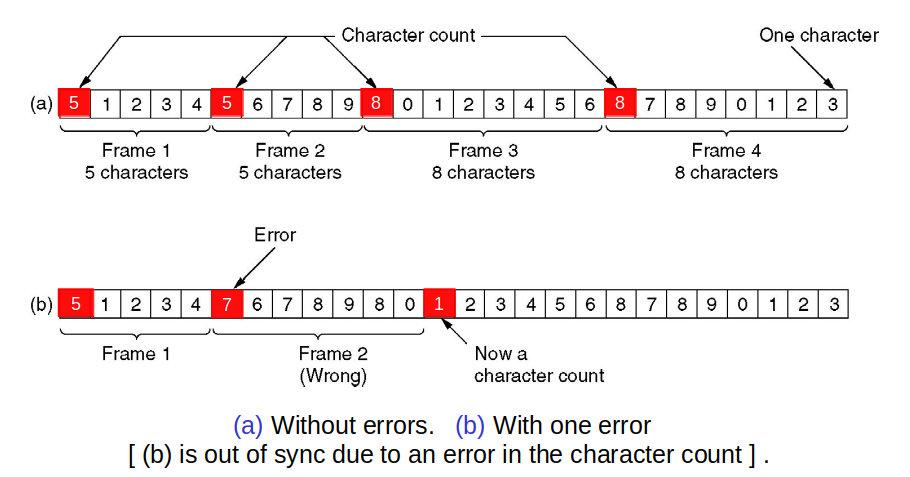
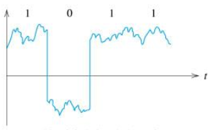

# Recap: Byte Count

- Frame begins with a count of the number of bytes in it
    - Simple, but difficult to resynchronize after an error

</img>

---

# Error Correction

---

# Codewords

- A frame consists of m data (message) bits and r redundant (check) bits.
- n-bit codewords with n =m+r

- ASCII code for “A”: 1000001
- codeword for “A”: 10000010  (r=1)

---

# Error Bounds – Hamming distance 

The number of bit positions in which two codewords differ is called the Hamming distance between these two codewords.

---

# Error Bounds – Hamming distance

#### Example with 2 codewords:
- Codeword #1:  1 0 0 0 1 0 0 1 
- Codeword #2:  1 0 1 1 0 0 0 1

- Hamming distance is 3. The number of bit positions in which two codewords differ

---

# Error Detection and Correction
### Hamming distance

<b> Step 1:</b> Ensure the two strings are of equal length.
- Codeword #1:  1  0   0   0   1   0   0  1 
- Codeword #2:  1  0   1   1   0   0   0  1

---

# Error Detection and Correction
### Hamming distance

<b>Step 2:</b> Compare the first two bits in each codeword (XOR them). If they are the same, record a "0" for that bit. If they are different, record a "1" for that bit.  Repeat the process for the remaining bits. 
- Codeword #1:  1  0   0   0   1   0   0  1 
- Codeword #2:  1  0   1   1   0   0   0  1
- Record:       0  0   1   1   1   0   0  0 

---

# Error Detection and Correction
### Hamming distance

<b>Step 3:</b> Add all the ones and zeros in the record together to obtain the Hamming distance. 
- Hamming distance = 0 + 0 + 1 + 1 + 1 + 0 + 0 + 0 = 3
- OR, count the number of 1s in the record. Three 1 bits in the record. i.e., Hamming distance is 3

---

# Hamming Codes

### Encoding: 
- We number the data bits starting from one and skipping the powers of two. The powers of two are reserved for parity bits. The rest are for message bits.

---

# Hamming Codes

### Decoding: 
- Calculate all parities. If they are all OK, there was no error. If not, add up the positions of the incorrect ones- this gives us the position of the error

---

# Error Correction – Hamming code
The Hamming code gives a simple way to add check bits and correct up to a single bit error:
- Check bits are parity over subsets of the codeword
- Recomputing the parity sums (syndrome) gives the position of the error to flip, or 0 if there is no error

---

# Error Correction – Hamming code

</img>

---

# Error Correction – Hamming code

0   0   1   0    0   0   0    1    0    0   1  (original codeword)

0   0   1   0    1   0   0    1    0    0   1  (received codeword)

---

# Error Correction – Hamming code

0   0   1   0    0   0   0    1    0    0   1  (original codeword)

- step #1: number the bits

1 2 3 4 5 6 7 8 9 10 11

0   0   1   0    1   0   0    1    0    0&nbsp&nbsp   1&nbsp  (received codeword)

---

# Error Correction – Hamming code

0   0   1   0    0   0   0    1    0    0   1  (original codeword)

- step #2: allocate parity bits and message bits- powers of 2 bits are parity bits and the rest are message bits

p1 p2 m3 p4 m5 m6 m7 p8 m9 m10 m11

0 &nbsp   0 &nbsp  1  &nbsp &nbsp 0 &nbsp &nbsp  1  &nbsp&nbsp 0  &nbsp&nbsp 0  &nbsp&nbsp  1  &nbsp&nbsp  0  &nbsp&nbsp  0  &nbsp&nbsp&nbsp&nbsp&nbsp 1  &nbsp&nbsp&nbsp (received codeword)

---

# Error Correction – Hamming code

0   0   1   0    0   0   0    1    0    0   1  (original codeword)

- step #3: finding the parity bits

p1 p2 m3 p4 m5 m6 m7 p8 m9 m10 m11

0 &nbsp   0 &nbsp  1  &nbsp &nbsp 0 &nbsp &nbsp  1  &nbsp&nbsp 0  &nbsp&nbsp 0  &nbsp&nbsp  1  &nbsp&nbsp  0  &nbsp&nbsp  0  &nbsp&nbsp&nbsp&nbsp&nbsp 1  &nbsp&nbsp&nbsp

- Finding p1:
    - Count one bit and skip one, starting from p1 but not including p1 value.
    - Add the 1s. If the result is even then p1 parity is 0, if the result is odd then p1 parity is 1.
    - p1 is? 1   1   0   0   1 &rightarrow; 1

---

# Error Correction – Hamming code

0   0   1   0    0   0   0    1    0    0   1  (original codeword)

- step #3: finding the parity bits

p1 p2 m3 p4 m5 m6 m7 p8 m9 m10 m11

0 &nbsp   0 &nbsp  1  &nbsp &nbsp 0 &nbsp &nbsp  1  &nbsp&nbsp 0  &nbsp&nbsp 0  &nbsp&nbsp  1  &nbsp&nbsp  0  &nbsp&nbsp  0  &nbsp&nbsp&nbsp&nbsp&nbsp 1  &nbsp&nbsp&nbsp

- Finding p2:
    - Count two bits and skip two, starting from p2 but not including p2 value.
    - Add up the result. If the result is even then p2 parity is 0, if the result is odd then p2 parity is 1
    - p2 is? 1   0   0   0   1 &rightarrow; 0

---

# Error Correction – Hamming code

0   0   1   0    0   0   0    1    0    0   1  (original codeword)

- step #3: finding the parity bits

p1 p2 m3 p4 m5 m6 m7 p8 m9 m10 m11

0 &nbsp   0 &nbsp  1  &nbsp &nbsp 0 &nbsp &nbsp  1  &nbsp&nbsp 0  &nbsp&nbsp 0  &nbsp&nbsp  1  &nbsp&nbsp  0  &nbsp&nbsp  0  &nbsp&nbsp&nbsp&nbsp&nbsp 1  &nbsp&nbsp&nbsp

- Finding p4:
    - Count four bits and skip four, starting from p4 but not including p4 value.
    - Add up the result. If the result is even then p4 parity is 0, if the result is odd then p4 parity is 1.
    - p4 is  ?   1   0   0   -    -  &rightarrow; 1

---

# Error Correction – Hamming code

0   0   1   0    0   0   0    1    0    0   1  (original codeword)

- step #3: finding the parity bits

p1 p2 m3 p4 m5 m6 m7 p8 m9 m10 m11

0 &nbsp   0 &nbsp  1  &nbsp &nbsp 0 &nbsp &nbsp  1  &nbsp&nbsp 0  &nbsp&nbsp 0  &nbsp&nbsp  1  &nbsp&nbsp  0  &nbsp&nbsp  0  &nbsp&nbsp&nbsp&nbsp&nbsp 1  &nbsp&nbsp&nbsp

- Finding p8:
    - Count eight bits and skip eight, starting from p8 but not including p8 value.
    - Add up the result. If the result is even then p8 parity is 0, if the result is odd then p8 parity is 1.
    - p8 is  ?   0   0   1   -    -  &rightarrow; 1  

---

# Error Correction – Hamming code

0   0   1   0    0   0   0    1    0    0   1  (original codeword)

- step #4: compare our result with the received parity bits.

0 &nbsp   0 &nbsp  1  &nbsp &nbsp 0 &nbsp &nbsp  1  &nbsp&nbsp 0  &nbsp&nbsp 0  &nbsp&nbsp  1  &nbsp&nbsp  0  &nbsp&nbsp  0  &nbsp&nbsp&nbsp&nbsp&nbsp 1  &nbsp&nbsp&nbsp

- p1 is  0   1   1   0   0   1 → 1 ✘  
- p2 is  0   1   0   0   0   1 → 0 ✔ 
- p4 is  0   1   0   0   -    -  → 1 ✘
- p8 is  1   0   0   1   -    -  → 1 ✔ 

- p1+p4 &rightarrow; in position 5

---

# Summary

- Link layer services

- Data Framing

- Error detection and correction

---

# MAC Layer

---

# Outline

- Elements of wireless network 
- Wireless links, characteristics, and types
- IEEE 802.11 wireless LANs (“Wi-Fi”) and features
    - Hidden and exposed terminal
    - Wireless LAN standards & architecture
- Channeling, association and scanning
- IEEE 802.11 MAC protocol
- CSMA/CA
- IEEE 802.11 framing

---

# Elements of a wireless network

</img>

---

# Elements of a wireless network

</img>

---

# Elements of a wireless network

</img>

---

# Elements of a wireless network

</img>

---

# Elements of a wireless network

</img>

---

# Elements of a wireless network

### Ad hoc mode
- No base stations
- Nodes can only transmit to other nodes within link coverage
- Nodes organize themselves into a network: route among themselves

---

# IEEE 802.11 Wireless LAN

- 802.11b, 802.11a, 802.11g, 802.11n (multiple antennae)...
- All use CSMA/CA for multiple access
- All have base-station and ad-hoc network versions

---

# Characteristics of selected wireless links

| Standard | Frequency Range | Data Rate     |
| -------- | --------------- | ------------- |
| 802.11b  | 2.4 GHz         | Up to 11 Mbps |
| 802.11a  | 5 GHz           | Up to 54 Mbps |
| 802.11g  | 2.4 GHz         | Up to 54 Mbps |
| 802.11n  | 2.5 and 5 GHz   | Up to 450 Mbps |
| 802.11ac | 5   GHz         | Up to 1300 Mbps |

---

# Wireless Link Characteristics

###  Important differences from wired link:
- <b>Decreasing signal strength:</b> radio signal attenuates as it propagates through matter (path loss)
- <b>Interference from other sources:</b> standardized wireless network frequencies (e.g., 2.4 GHz) shared by other devices (e.g., phone); devices (motors) interfere as well
- <b>Multipath propagation:</b> radio signal reflects off objects ground, arriving at destination at slightly different times

---

# Signals

A signal is a time-varying quantity (e.g. voltage, or electromagnetic waves) that conveys information.

---

#  Properties of signals

   y(t) = A sin( 2 π f t + φ )

Here:
- A: amplitude
- f: frequency, the number of oscillations (in Hz)
- ω = 2πf: angular frequency
- φ: phase, specifies position at t = 0

---

# Example: wired connection
- High and low voltages give a distinguishable waveform

</img>

- Noise in the signal needs to be removed
- translate into a binary signal (only two states)

---

# Wireless connection

Radio waves are a form of eletctromagnetic radiation with wave forms between 30 Hz and 300 GHz.

 

- Generated by oscillating electic fields
- In the receiver the radio singla create a tiny voltage which can be measured

---

# Wireless network characteristics

### Hidden terminal problem

- Hidden terminals are senders that cannot sense each other but nonetheless collide at intended receiver

</img>

- B, A hear each other
- B, C hear each other
- A, C can not hear each other means A, C unaware of their interference at B

---

### Signal Attenuation

</img>

- B, A hear each other
- B, C hear each other
- A, C can not hear each other interfering at B

---

# Exposed Terminals
Exposed terminals are senders who can sense each other but still transmit safely (to different receivers) 
Desirably concurrency; improves performance
B   ↔ A and C   ↔   D are exposed terminals

</img>

---

# Roadmap
- Elements of wireless network 
- Wireless links, characteristics, and types
- IEEE 802.11 wireless LANs (“Wi-Fi”) and features
    - Hidden and exposed terminal
    - Wireless LAN standards & architecture
- Channeling, association and scanning
- IEEE 802.11 MAC protocol
    - CSMA/CA
    - IEEE 802.11 framing

