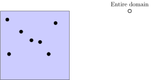
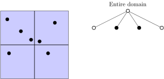
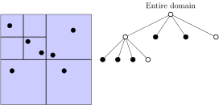
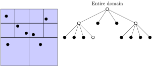
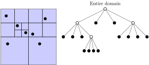

# The Barnes-Hut Algorithm

  J. Barnes, P. Hut: <em> A hierarchical O(N log N) force calculation algorithm</em>.
  Nature 324, 1986, p. 446.

---

 # Barnes Hut Method -- Key Ideas
  
 ## Short-range Forces:
 - strong and weak nuclear force 
 - fast decay of force contributions with increasing distance
    * dense force matrix with $\mathcal{O}(n^2)$, but mostly very small entries
    * with cut-off: force matrix is sparse
    * complexity of entire force calculation can be reduced to $\mathcal{O}(N)$

---

# Barnes Hut Method -- Key Ideas
## Long-range Forces:
- gravity, electromagnetic force
- slow decay of force contributions with increasing distance
  * cut-off of force matrix not possible, even far away particles need to be taken into account

<em>Is it possible to reduce the complexity for the computation of long-range forces? </em>

---

# Barnes Hut Method -- Key Ideas

## Consider Astrophysics:
- force w.r.t. a far-away individual star might be neglected
- but not the force w.r.t. a far-away galaxy
  * approximate forces on a individual star by grouping far-away stars, galaxies, etc. into clusters
  * represent clusters by accumulated mass located at its centre-of-mass
 
<!--- </img>-->

---

# Barnes Hut Method -- Key Ideas

- developed 1986 for applications in Astrophysics
- for gravitational force:
 $$
    \vec{F}_{ij} = \vec{F}(\vec{r}_i, \vec{r}_j) = -\gamma_\text{grav}\frac{m_i m_j (\vec{r}_i - \vec{r}_j)}{\|\vec{r}_i - \vec{r}_j \|^3} 
 $$
- uses octree with 0 or 1 particles per cell
-  inner nodes corresp. to clusters of particles (<em>pseudo particle</em>)
- <b>idea:</b> gravity force of particle cluster approximated (sum of masses,
 localised in centre of mass) 
- same can be done for electromagnetic force (sum charges)

---

# Octrees and Quadtrees for Domain Decomposition

- clustering of particles required, where size of clusters depends on the distance to each individual particle 
- solved by multi-level tree-based domain decomposition
- to be done for every particles position   (in practice via hierarchical domain decomposition)

---

# Octrees and Quadtrees for Domain Decomposition

---

# Octrees and Quadtrees for Domain Decomposition

---

# Octrees and Quadtrees for Domain Decomposition

---

# Octrees and Quadtrees for Domain Decomposition

---

# Octrees and Quadtrees for Domain Decomposition

---

<section>
  <h3>Barnes-Hut Algorithm</h3>

### Create point cloud

<small>

- Visualisation by Jeffrey Heer
- <url>https://jheer.github.io/barnes-hut/</url>

</small>

### Subdivide domain into quadtree

<small>

- distribute long-range region into subdomains: $$ \Omega^{\rm{far}} = \bigcup_i \Omega^{\rm{far}}_i$$

For each particle (position $x\in\Omega$):
- start in root node
- descent into subdomains and subdivide until every domain contains 0 or 1 particles

</small>

  

### Compute centers of mass or charge

<small>

- assign a point $y_0^i$ to each $\Omega^{\rm{far}}_i$ corresponding to the center of mass
-  for each subdomain compute total mass by summing particles in that subdomain
- decomposition depending on size of subdomains:
$$  \text{diam} := \sup_{y\in\Omega^{\rm{far}}_i} \|y-y_0^i\| $$

</small>

  

### Force computation

<small>

For each particle (position $x\in\Omega$):
- start in root node
- descent into subdomains, until $\theta$-rule satisfied: $$ \frac{diam}{r} \leq \theta,$$ 
   $r$ the distance of pseudo particle from $x$
- accumulate corresp. partial force to current particle

</small>

  

  

</section>

---

# Barnes-Hut: Computation of Forces

Implicit separation of short- and longe-range forces:
- short-range: all leaf nodes that are reached (containing 1 particle)
- long-range: all inner nodes, where descent is stopped (force caused by pseudo particle) 

---

# Barnes-Hut: Accuracy and Complexity

# Accuracy of Barnes-Hut:
- depends on choice of $\theta$
- the smaller $\theta$, the more accurate the long-range forces
- the smaller $\theta$, the larger the short-range (i.e., the costs)
- slow convergence w.r.t. $\theta$ (low-order method)

---

# Complexity:
- grows for small $\theta$
- for $\theta\rightarrow 0$: algorithm degenrates to ``all-to-all'' $\to$ $\mathcal{O}(N^2)$
- for more or less homogeneously distributed particles:
    * number of active cells: $\mathcal{O}( \log N  / \theta^3)$
    * total effort therefore $\mathcal{O}(\theta^{-3}N\log N)$

---

# Barnes-Hut: Implementation

- computation of pseudo particles:
  * bottom-up-traversal (post-order)
  * sum up masses, weighted average for centre-of-mass
- computation of forces:
  * traversal of entire tree (outer loop on all particles)
  * top-down traversal (pre-order) until $\theta$-rule satisfied (inner loop)
- further traversals for time integration
- re-build (or update) octree structure after each time step $\to$ requires efficient data structures and algorithms
