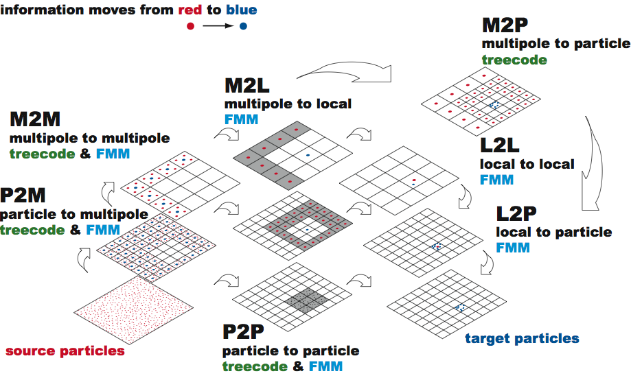

# Fast Multipole

  L. Greengard, V. Rokhlin: <em>A fast algorithm for particle simulations.</em> J. Comp. Phys., 73, 1987.
  
  C. R. Anderson: <em>An implementation of the Fast Multipole Method without multipoles.</em>.
  SIAM J. Sci. Stat. Comput. 13(4), 1992.

---

<section>
  <h3>Barnes-Hut vs. Multigrid</h3>

- <b>Barnes-Hut:</b> compute forces of pseudo particles to particles 
- <b>Fast Multipole:</b> compute forces between pseudo particles

<button class="btn-large btn-warning" id="recolorButton">Recolorize</button>
  

  

</section>

---

## Let's draft a possible algorithm in a strongly simplified setting:
- consider a ``Linked Cell''-type grid $\to$ each grid cell contains a list of particles
- define a pseudo particle (as in Barnes-Hut) for each linked cell 
 $\to$ accumulated mass located in centre of mass
- force computation:
   1. between particles in the same or in adjacent cells: add particle--particle force 
   2. between particles in separated cells: 
      * add forces between corresponding pseudo-particles;
      * accumulate that force to all particles of a pseudo particle

---

## Box--Box Interactions in a Linked Cell Fashion

- consider a ``Linked Cell''-type grid 

  $\to$ each grid cell $C_k$ contains a list of particles: $x^{(k)}_i$, $m^{(k)}_i$
- define a pseudo particle (as in Barnes-Hut) for each linked cell 
  
  $\to$ locate centre of mass $X_l := \frac{1}{M_l} \sum_j m^{(l)}_j x^{(l)}_j$

  $\to$ accumulated mass $M_l := \sum_j m^{(l)}_j $

---

## Box--Box Interactions in a Linked Cell Fashion

- add up particle--particle forces between particles in adjacent cells $C_k$ and $C_l$:

 For all $x^{(k)}_i$, $m^{(k)}_i$ in cell $C_k$:

  $$ F^{(k)}_i = F^{(k)}_i \pm \sum  \frac{ \gamma m^{(k)}_i m^{(l)}_j }{ \bigl| x^{(k)}_i - x^{(l)}_j \bigr|^2} $$

---

## Box--Box Interactions in a Linked Cell Fashion

- add up forces between separated cells $C_l$ 
 
 $\to$ add potential caused by pseudo particles of $C_l$:
 
 - for all cells $C_l$ with pseudo particle of mass $M_l$ at position $X_l$ accumulate potential: 
 $$ \Psi_k = -\gamma \sum M_l / \bigl| X_k - X_l \bigr| $$

 - <em>or,</em> accumulate forces, considering correct sign: 
 $$ F^{(k)}_i = F^{(k)}_i \pm \sum\gamma m^{(k)}_i M_l / \bigl| X_k - X_l \bigr|^2 $$

---

## Less simplified setting: Box--Box Interactions in a Multigrid Fashion

<b>Idea:</b> accumulate potentials $\Psi_k$, then multiple with factors

- add a hierarchy of grids as in multigrid methods

  $\to$ finest grid contains a list of particles for each cell 

  $\to$ all grids contain a pseudo particle (as in Barnes-Hut)

---

## Less simplified setting: Box--Box Interactions in a Multigrid Fashion
- force computation on the finest level: identical to ``Linked Cell'' Fashion on previous slide
         
- force computation between pseudo particles:
  1. between pseudo particles in <em>nearby</em> cells:     add pseudo-particle--pseudo-particle force 
  2. between pseudo particles in <em>far away</em> cells:   add force between corresp. pseudo-particles on next-coarser level

<b>Do we catch all interactions? 
   How to define in <em>nearby</em> and </em>far away</em>?</b>

---

## Box--Box Interactions in a Multigrid Fashion
- box--box interactions occur at multiple levels 
   
  $\to$ as particles are part of all parent/grand-parent pseudo particles, the interaction between two particles might be captured by box--box interactions on multiple levels

  $\Rightarrow$ make sure that each particle--particle interaction is considered exactly once!

---

## Box--Box Interactions in a Multigrid Fashion
- force computation between pseudo particles occurs, if:
   1. pseudo particles are not in cells that are direct neighbours (requires particle--particle interaction, no approximation via pseudo particles allowed) 
   2. interaction between the boxes that contain those pseudo particles is not considered on coarser levels
        
        $\to$ considers comparably few interactions on each level that are ``nearby'' but neither direct neighbours nor too far away

---

## Box--Box Interactions in a Multigrid Fashion
- different concepts for <em>far away</em> boxes: 
    * Barnes-Hut-type: $\theta$-criterion
    * Fast-Multipole-type: not in an adjacent cell
    
     ($\leadsto$ <em>well separated</em>)

---

## Box--Box Interactions in a Multigrid Fashion
- Fast Multipole introduces <em>box--box interactions</em>:
   * compute the approximate potential (and resulting forces) that (all particles of) a box cause(s) in a remote box (on the same level)
   * pass on the accumulated (approximate) potentials resulting from the box--box approximations to the child boxes 

---

## Box--Box Interactions in a Multigrid Fashion

- Well-separated boxes instead of $\theta$-criterion
  * two boxes are called <em>well separated</em>, if there is at least one entire box (of the same level) between them
     
     $\to$ fixed geometric criterion 
     
     $\to$ no influence on pseudo-particle positions 
     
     $\to$ no $\theta$ available to control accuracy 

---

# Comparison of Barnes-Hut and Fast Multipole

### approximate potential of sets/clusters of particles

Barnes-Hut

- pseudo particles in tree cells 

Fast Multipole

- higher-order representations necessary! 

- (simple pseudo particles together with well-separated criterion is too inaccurate)

### hierarchical computation of box potentials

Barnes-Hut

- combine pseudo particles in child cells

Fast Multipole

- generate high order box potentials
- (accumulate approximate potentials of child boxes to approximate potential of parent box $\to$ needs to be derived for high-order representation)

---

# Approximate ``Box potentials''

## 2 Approaches: 

### Original Approach of Greengard/Rohlkin, 1987
- similar concept as Taylor series
- complicated to derive, esp. in 3D (spherical harmonics) 
- complicated formula for hierarchical assembly

---

# Approximate ``Box potentials''

## 2 Approaches: 

### Or: inner/outer ring approximations by Anderson, 1992
- derived via numerical integration of an integral formula
- uniform interaction with child and remote boxes
- hierarchical assembly via evaluation of potentials at integration points

---

# Multipole Expansion

explain how to get the multipole expansion

---

# A simplified Algorithm

 Start with a cell $C_l$

1. compute the far-field using multipole expansion
2. Refine $C_l$ and move to a sub-cell
   

if finest level:

  
3. Compute direct interactions (particle-to-particle)
   

else

3. go to 1.

---

# A simplified Algorithm

fancy animation go here

---

# Fast Multipole Method (FMM)

1. Initialization
 
  Choose a number of levels such that there are approx. $s$ particles per cell at the finest level. $\to$ $N/s$ cells
  
2. Upward Pass
 
 Beginning at the finest level create multipole expansions from the source positions and strengths. The expansions for all cells at all higher levels are then formed by the merging.

2. Downward Pass

 Convert the multipole expansion into a local expansion about the centers of all cells in $C_l$’s inter-action list.

---

# What's missing?

1. A method for merging multipole expansions to compute expansions for cells at higher levels
2. A method for converting the multipole expansion into local expansion

---

# Fast Multipole Method -- Summary

R. Yokota: 
<url>https://www.bu.edu/pasi/courses/12-steps-to-having-a-fast-multipole-method-on-gpus/</url>

</img>

---

# Fast Multipole Method -- Summary

## Accuracy:
- depends on accuracy of integration rule 
    
  $\to$ determined by number of integration points

- in practice: can be increased to allow approximations that are accurate up to machine precision

---

# Fast Multipole Method -- Summary

## Complexity:
- computation of box-approximations, i.e., all $g( a \vec{s}_i )$ 
  
  $\to$ constant effort per box (leaf and inner boxes)
  
  $\to$ thus $O(N_\text{B})$ effort ($N_\text{B}$ boxes); 
    
- if max. number of particles per box is constant then $O(N)$ for $N$ particles
- computation of forces
  
  $\to$ multilevel algorithms leads to $O(N)$ effort
